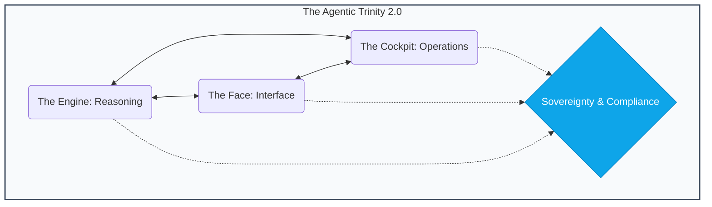
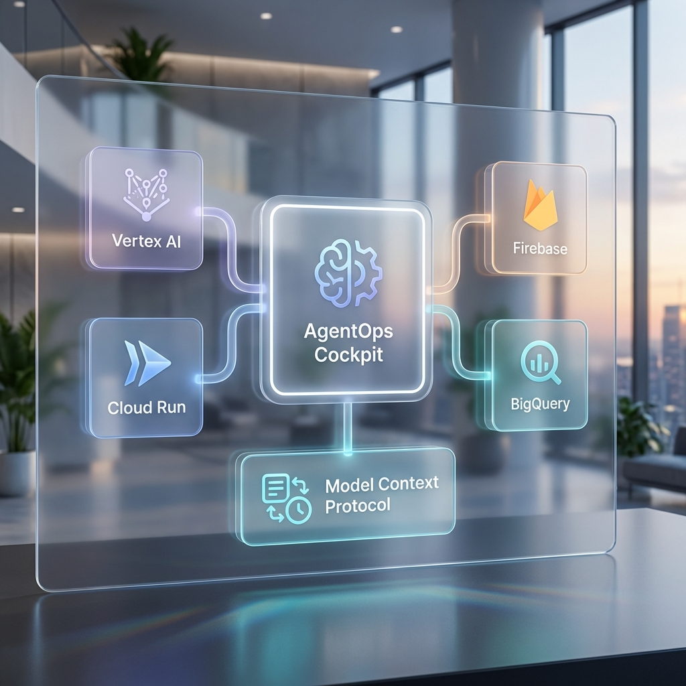

# 🕹️ AgentOps Cockpit

  

   
  <a href="https://agent-cockpit.web.app" target="_blank"><strong>🌐 Official Website & Live Demo</strong></a>
    
  
   
   
  
  
  
  

 

  <h3>"Infrastructure gives you the pipes. We give you the Intelligence."</h3>
  
The developer distribution for building, optimizing, and securing AI agents on Google Cloud.

---

## 📽️ The Mission
Most AI agent templates stop at a single Python file and an API key. **The AgentOps Cockpit** is for developers moving into production. It provides framework-agnostic governance, safety, and cost guardrails for the entire agentic ecosystem.

- **Governance-as-Code**: Audit your agent against [Google Well-Architected](/docs/GOOGLE_ARCHITECTURE.md) best practices with the **Evidence Bridge**—real-time citations for architectural integrity.
- **SME Persona Audits**: Parallelized review of your codebase by automated [**Principal SMEs**](docs/TECHNICAL_AUDIT_GUIDE.md) across FinOps, SecOps, Architecture, and Quality.
- **Agentic Trinity**: Dedicated layers for the Engine (Logic), Face (UX), and Cockpit (Ops).
- **A2A Connectivity**: Implements the [**Agent-to-Agent Transmission Standard**](docs/TECHNICAL_A2A_GUIDE.md) for secure swarm orchestration.
- **MCP Native**: Registration as a [Model Context Protocol](https://modelcontextprotocol.io) server for 1P/2P/3P tool consumption.

---

## 🏗️ The Agentic Trinity
We divide the complexity of production agents into three focused pillars:

- **⚙️ The Engine**: The reasoning core. Built with **ADK**, FastAPI, and Vertex AI.
- **🎭 The Face**: The user experience. [Adaptive UI surfaces](docs/TECHNICAL_UX_GUIDE.md) and **GenUI** standards via the A2UI spec.
- **🕹️ The Cockpit**: The operational brain. [Cost control](docs/TECHNICAL_FINOPS_GUIDE.md), semantic caching, shadow routing, and [adversarial audits](docs/TECHNICAL_REDTEAM_GUIDE.md).

 

---

## 🏛️ v1.3: The "Autonomous Architect" Standard (NEW)
Evolving from a compliance tool to an autonomous evolution engine. See the [**v1.3 Roadmap**](/docs/ROADMAP_V13.md).

- **🚀 Context-Aware Patching**: Moving from templates to LLM-Synthesized PRs that match your project's style.
- **🧪 Digital Twin Simulation**: `make simulation-run` for high-concurrency "Stress-Reasoning" test. [**Read Guide**](docs/TECHNICAL_ARCH_REVIEW.md).
- **🧗 Hill Climbing Optimization**: Iterative prompt tuning to reach the Global Peak. [**Read Guide**](docs/TECHNICAL_QUALITY_GUIDE.md).
- **🌍 Strategic Exit Strategy**: Automated TCO reports and migration plans for moving between cloud providers.

---

## 🚀 Key Innovation: The "Intelligence" Layer

### 🛡️ Red Team Auditor (Adversarial SRE)
Don't wait for your users to find prompt injections. Use the built-in [**Adversarial Evaluator**](docs/TECHNICAL_REDTEAM_GUIDE.md) to launch self-attacks against your agent, testing for PII leaks, instruction overrides, and multilingual jailbreaks.

### 🧠 Hive Mind (Semantic Caching)
**Reduce LLM costs by up to 40%.** The Hive Mind checks for semantically similar queries in 10ms, serving cached answers for common questions without calling the LLM.

### 🏛️ Arch Review & Autonomous Evolution
Every agent in the cockpit is graded against a framework-aware checklist. The Cockpit intelligently detects your stack and runs a tailored [**Architecture Review**](docs/TECHNICAL_ARCH_REVIEW.md). v1.3 introduces **Autonomous Evolution**—the ability to synthesize code fixes directly from audit findings.

### 🕹️ MCP Connectivity Hub (Model Context Protocol)
Stop building one-off tool integrations. The Cockpit provides a unified hub for **MCP Servers**. Connect to 1P/2P/3P tools via the standardized Model Context Protocol for secure, audited tool execution. Start the server with `make mcp-serve`.

### 🗄️ Situational Database Audits
The Cockpit now performs platform-specific performance and security audits for **AlloyDB**, **Pinecone**, **BigQuery**, and **Cloud SQL**.

---

### 🛡️ Advanced Governance & Discovery
Modern agents don't just live in `agent.py`. The Cockpit uses a centralized **Discovery Engine** to intelligently map your project:
- **`.gitignore` Compliance**: Zero-noise scanning that respects your project's ignore rules.
- **Library Isolation**: Intelligently ignores hits in `venv` or `node_modules` to focus on your code.
- **Config-Driven**: Use `cockpit.yaml` to define custom entry points, exclusions, and CI/CD thresholds.

---

## ⌨️ Master Command Registry

The Cockpit is available as a first-class CLI and a comprehensive Makefile-based operational toolkit.

| Registry | Description |
| :--- | :--- |
| 🕹️ [**Makefile Commands**](docs/TECHNICAL_COMMANDS_MASTER.md) | Standard local development and orchestration shortcuts. |
| 🚀 [**UVX Master Guide**](docs/TECHNICAL_UVX_MASTER.md) | Portable, zero-install commands for CI/CD and automation. |

---

## 🧑‍💼 Principal SME Persona Approvals
The Cockpit now features a **Multi-Persona Governance Board**. Every audit result is framed through the lens of a Principal Engineer in that domain:
*   [**🏛️ Architecture**](docs/TECHNICAL_ARCH_REVIEW.md)
*   [**💰 FinOps**](docs/TECHNICAL_FINOPS_GUIDE.md)
*   [**🛡️ Red Team**](docs/TECHNICAL_REDTEAM_GUIDE.md)
*   [**🧗 Quality**](docs/TECHNICAL_QUALITY_GUIDE.md)
*   [**🌐 Infrastructure**](docs/TECHNICAL_INFRA_GUIDE.md)
*   [**🎭 UX/UI**](docs/TECHNICAL_UX_GUIDE.md)

---

## 🚀 1-Click Production Pipeline
`make deploy-prod` triggers the following lifecycle:
1. Runs the Quick Safe-Build (`make audit`).
2. Compiles production frontend assets.
3. Deploys the Engine to **Google Cloud Run**.
4. Deploys the Face to **Firebase Hosting**.

---

## 🤝 Ecosystem & Attribution
The AgentOps Cockpit is designed to leverage and secure the best-of-breed tools in the Google Cloud ecosystem. We explicitly acknowledge and leverage the excellent work from:

*   **[GoogleCloudPlatform/agent-starter-pack](https://github.com/GoogleCloudPlatform/agent-starter-pack/)**: We leverage this as a core reference for the **Agent Development Kit (ADK)** patterns and Vertex AI Agent Engine integration.
*   **A2A Standard**: Our implementation follow the Agent-to-Agent Transmission Protocol for swarm intelligence.

---
*Reference: [Google Cloud Architecture Center - Agentic AI Overview](https://docs.cloud.google.com/architecture/agentic-ai-overview)*
