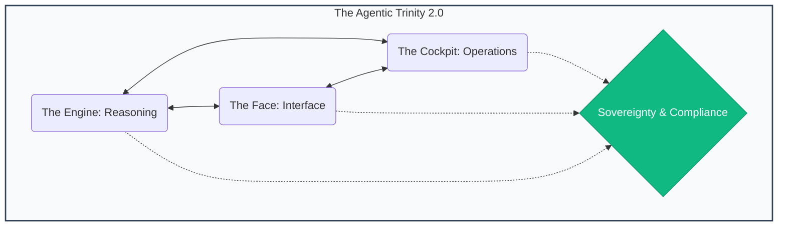

# 🕹️ AgentOps Cockpit (v2.0.3 Sovereign Evolution)

<div align="center">
  
</div>

<div align="center">
  <br />
  <a href="https://agent-cockpit.web.app" target="_blank"><strong>🌐 Official Website & Live Demo</strong></a>
  <br /><br />
  <a href="https://deploy.cloud.google.com?repo=https://github.com/enriquekalven/agent-cockpit">
    
  </a>
  <br />
  <br />
  
  
  
  
</div>

<br />

<div align="center">
  <h3>"Infrastructure gives you the pipes. We give you the Intelligence."</h3>
  <p>The developer distribution for building, governing, and scaling Sovereign AI agents.</p>
</div>

---

## 🚀 The Sovereign Mission
Most AI templates stop at a single Python script. **The AgentOps Cockpit** is for developers moving into production. It provides framework-agnostic governance, multi-cloud mobility, and real-time security for the entire agentic ecosystem.

- **🏛️ The Governing Board**: Every repository is audited by a panel of [**Principal SME Personas**](docs/TECHNICAL_AUDIT_GUIDE.md) (SecOps, FinOps, SRE, Architect) using **SME Reasoning**.
- **🌉 Sovereign Bridge**: Multi-cloud orchestration layer for GCP, AWS, and Azure.
- **🛡️ Sovereign Gateway**: Real-time sidecar for PII scrubbing and [**A2A Evidence Packets**](docs/TECHNICAL_A2A_GUIDE.md).
- **🕹️ Agentic Trinity 2.0**: Specialized layers for the **Engine** (Logic), **Face** (UX), and **Cockpit** (Ops).

---

## ⚡ Quick Start: One Command to Rule Them All

The Cockpit is designed for high-velocity fleet management. If you are overwhelmed by the options, just remember **one command**:

```bash
# 🕹️ Master Audit: Launch the Governing Board & Personal SME Review
ops report
```

### 🏹 The Sovereign Workflow
1. **Explore**: `cockpit` (Launch the Mission Control Dashboard)
2. **Audit**: `ops report` (Deep SME Reasoning Review)
3. **Remediate**: `make apply-fixes` (Autonomous code hardening via the **Closer Engine**)
4. **Deploy**: `ops deploy sovereign` (Multi-cloud Factory Deployment)

---

## 🏗️ The Agentic Trinity
We divide the complexity of production agents into three focused pillars:



- **⚙️ The Engine**: The reasoning core. Built with **ADK**, FastAPI, and Vertex AI.
- **🎭 The Face**: The user experience. [Sovereign UX (A2UI)](docs/TECHNICAL_UX_GUIDE.md) and rich GenUI standards.
- **🕹️ The Cockpit**: The operational brain. [Cost control (FinOps)](docs/TECHNICAL_FINOPS_GUIDE.md), semantic caching, and [adversarial audits (Red Team)](docs/TECHNICAL_REDTEAM_GUIDE.md).

---

## 🏛️ v2.0.2: The "Sovereign Evolution" Release
Evolving into the industry standard for production governance. See the [**CHNGELOG.md**](/CHANGELOG.md).

- **🛡️ Sovereign Gateway**: Real-time PII scrubbing and [**Sovereign Security**](docs/TECHNICAL_REDTEAM_GUIDE.md).
- **🌉 Sovereign Bridge**: Multi-cloud deployment to GCP, AWS, and Azure.
- **🧠 Semantic Hive Mind**: Distributed caching that reduces LLM costs by up to 40%.
- **🖇️ A2A Evidence Packets**: Cryptographically signed reasoning traces for multi-agent trust.
- **🔧 Closer Engine 2.0**: Autonomous remediation of code gaps and architectural debt.

---

## 🏛️ Multi-Persona Governance Board
The Cockpit allows you to view your codebase through the lens of a Principal Engineer:
*   [**🏛️ Architecture**](docs/TECHNICAL_ARCH_REVIEW.md)
*   [**⚖️ Compliance**](docs/TECHNICAL_COMPLIANCE_GUIDE.md)
*   [**💰 FinOps**](docs/TECHNICAL_FINOPS_GUIDE.md)
*   [**🛡️ Red Team**](docs/TECHNICAL_REDTEAM_GUIDE.md)
*   [**🧗 Quality**](docs/TECHNICAL_QUALITY_GUIDE.md)
*   [**🌐 SRE & Infra**](docs/TECHNICAL_INFRA_GUIDE.md)
*   [**🎭 UX (A2UI)**](docs/TECHNICAL_UX_GUIDE.md)

---

## 🛡️ Privacy & Telemetry
The AgentOps Cockpit follows a **Privacy-First, Sovereign Standard**. 

By default, the CLI sends anonymous operational metrics (e.g., command names, OS type) to help us understand fleet health. **We do not collect PII, code snippets, secrets, or folder paths.**

### 🌑 How to Opt-Out
Disable telemetry by setting:
```bash
export AGENTOPS_TELEMETRY_ENABLED=false
```
Or update your `cockpit.yaml`:
```yaml
telemetry:
  enabled: false
```

---

## 🤝 Ecosystem & Attribution
The AgentOps Cockpit leverages and secures the best-of-breed tools in the ecosystem:

*   **[Google ADK](https://github.com/GoogleCloudPlatform/agent-starter-pack/)**: Core reference for agent patterns.
*   **[A2UI Protocol](https://github.com/GoogleCloudPlatform/agent-starter-pack/tree/main/src/a2ui)**: Standardized Generative UI handshake.
*   **[A2A Standard](https://github.com/GoogleCloudPlatform/agent-starter-pack/blob/main/docs/A2A_GUIDE.md)**: Agent-to-Agent Transmission Protocol.
*   **[Model Context Protocol (MCP)](https://modelcontextprotocol.io)**: Unified tool execution standard.
*   **[Vertex AI SDK](https://cloud.google.com/vertex-ai/docs/python-sdk)**: Backbone for frontier reasoning.
*   **[Firebase](https://firebase.google.com/)**: Enterprise hosting for the **Face** layer.

---
*Generated by the AgentOps Cockpit. Sovereign Systems Division (v2.0.2 Evolution).*
