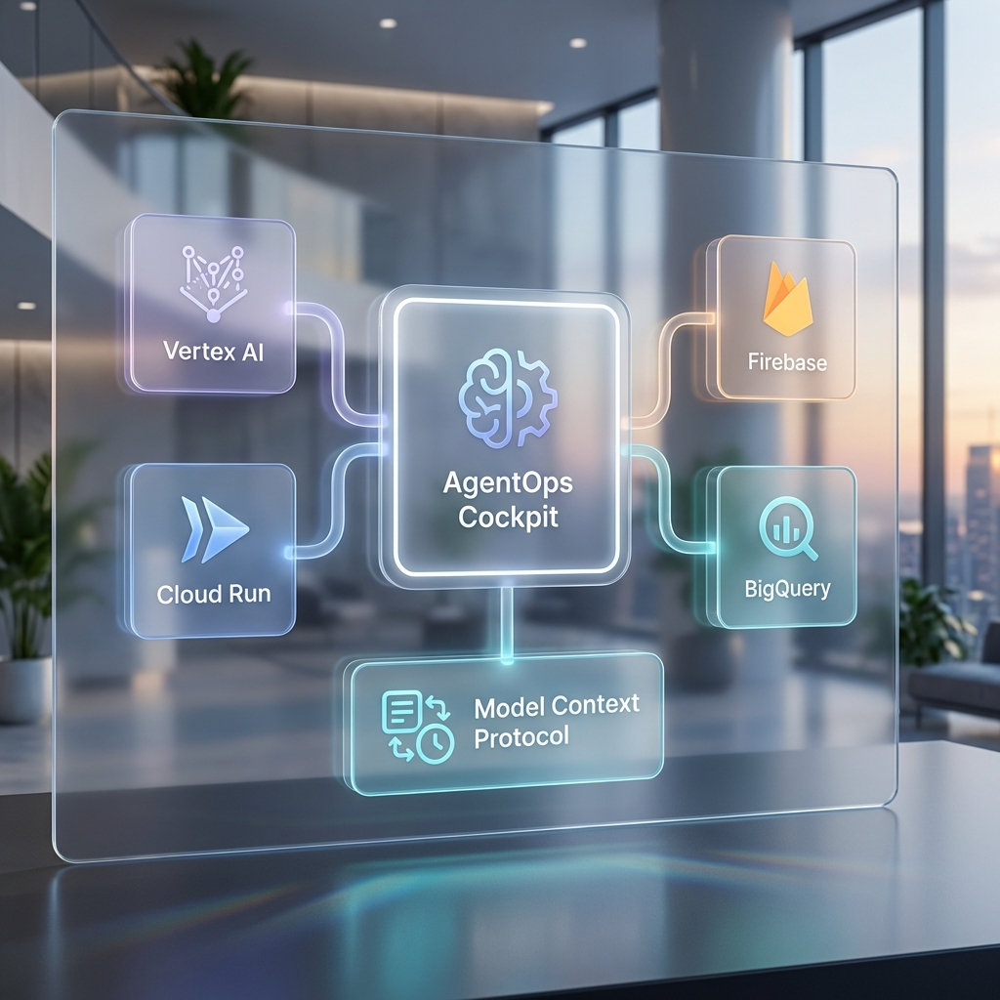

---

<div align="center">
  
</div>

## 🏗️ The Three Pillars (v2.0.10 Autonomous Core Evolution)

### 1. The Engine (Reasoning)
*   **Role**: Multi-model reasoning, Cockpit Bridge connectivity, tool execution.
*   **Standard**: [Google ADK](https://github.com/a2aproject/adk) (Multi-Cloud Abstraction).
*   **Operations**: Governed by `ops report`.

### 2. The Face (User Experience)
*   **Role**: GenUI Rendering, A2UI Protocol Sync, Surface Discovery.
*   **Standard**: [A2UI Spec](https://a2ui.org).
*   **Operations**: Verified by UX SME Reasoning.

### 3. The Cockpit (Agent Operations)
*   **Role**: Governance, Multi-Cloud SRE, FinOps, Cockpit Gateway.
*   **Standard**: **Cockpit Standard (v2.0.10 Autonomous Core)**.
*   **Operations**: The centralized control plane for multi-cloud production.

---

## 🌉 The Cockpit Bridge (Multi-Cloud Mobility)
The Cockpit implements a **Unified Governance Layer** that abstracts the underlying cloud provider.
- **Provider Parity**: Run the same audit on a Vertex AI agent (GCP) or a Bedrock agent (AWS).
- **VPC Isolation**: Enforces egress control and PII scrubbing via the **Cockpit Gateway** sidecar.
- **Unified Auth**: Single-command credentials for GCP, AWS, and Azure via `ops sys doctor`.

---

## 📡 The A2A (Agent-to-Agent) Handshake
In a Cockpit swarm, trust is earned through evidence. The Cockpit implements the **Reasoning Evidence Packet** standard.
- **Trace IDs**: Full lineage of the thought process across clouds.
- **PII Health**: Cryptographic confirmation that data was scrubbed via the standard proxy.
- **Assurance Scores**: Confidence intervals for the reasoning path decoded by the **Governing Board**.

---

## 🏛️ Cockpit Governance Alignment
By using the Cockpit, you are automatically building toward four critical pillars:

| Pillar | Cockpit Mechanism |
| :--- | :--- |
| **Operational Excellence** | [Automated Flight Recording](./COCKPIT_GUIDE.md) |
| **Cockpit Security** | [Adversarial Red Teaming](./TECHNICAL_REDTEAM_GUIDE.md) |
| **Economic Sustainability** | [FinOps & distributed cache Caching](./TECHNICAL_FINOPS_GUIDE.md) |
| **Reasoning Efficiency** | [A2A Evidence Packets](./TECHNICAL_A2A_GUIDE.md) |

---

## ⚡ The Architectural Verdict
Run the Cockpit Architecture Review now to see how your repo stacks up:
```bash
ops report --mode deep
```
---
*Generated by the AgentOps Cockpit. Cockpit Systems Division (v2.0.10 Autonomous Core Autonomous Core).*
