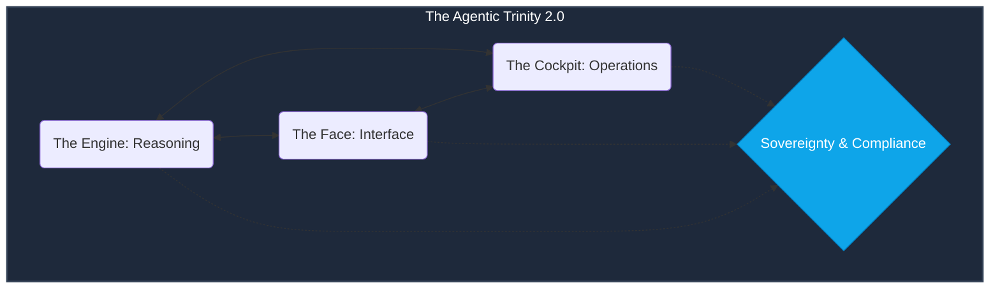

## The "Command Simplification" Release (v1.4.7 Stable)

The AgentOps Cockpit has been simplified. We have moved from fragmented SME commands to a unified **Master Orchestrator**. The heartbeat of the ecosystem is now `agent-ops report`.

👉 **[Core Capabilities & Regression Registry](CAPABILITIES_REGISTRY.md)**

---

## 🏗️ The Agentic Trinity 2.0
Every audit is framed against the Trinity architecture, where **Sovereignty & Compliance** act as a mandatory horizontal layer securing the Engine, Face, and Cockpit.



---

## 🛠️ Unified Audit Lifecycle

We have reduced permutations to focus on the **mode** of the audit rather than the specific SME.

| Command | Objective | Impact |
| :--- | :--- | :--- |
| `make audit` | **Safe-Build** | Quick: Secrets, Reliability, and Fast Security. |
| `make audit-deep` | **Deep Probe** | The "Final Exam": RAG Fidelity, stress tests, and benchmarks. |
| `make apply-fixes`| **Remediation** | Triggers AST-based code patches for detected gaps. |
| `agent-ops audit` | **Interactive** | Real-time optimization loop for `agent.py`. |
| `agent-ops sovereign`| **End-to-End**| [10X] The ultimate factory: Audit -> Fix -> Hydrate -> Deploy -> Register. |
| `agent-ops workbench`| **Negotiation** | Review and approve autonomous fixes (v1.4.2). |

---

## 🎯 Modular Auditing & Filtering
High-precision filtering allows you to run a full report but only for specific personas:
- **`--only security`**: Run only the SecOps Principal checks.
- **`--skip quality`**: Exclude heavy Hill Climbing for faster CI.

---

## 📁 Artifact Sovereignty: The `.cockpit/` Store
All audit outputs are centralized in your project:
- **`.cockpit/patches/`**: Proposed code fixes (v1.4.2).
- **`.cockpit/cockpit_report.html`**: The unified stakeholder dashboard.
- **`.cockpit/evidence_lake.json`**: The technical truth for the audit.

---

## 📡 Telemetry & Transparency
The AgentOps Cockpit includes anonymous telemetry to help us understand usage patterns and improve the platform. We track:
- **Events**: Audit start/completion, package imports, and command usage.
- **System**: OS type, Python version, and Cockpit version.
- **Privacy**: No code, secrets, or PII are ever collected. IDs are anonymized.

**Opt-out**: You can disable telemetry by setting the environment variable:
```bash
export AGENTOPS_TELEMETRY_ENABLED=false
```

---

## 🏢 The Principal SME Persona Matrix

Every report finding is still authored by a specialized SME:
1. **🔐 SecOps Principal**: Credential hygiene and zero-trust.
2. **🏛️ Autonomous Architect**: Structural integrity and remediation.
3. **🧗 AI Quality SME**: RAG fidelity and prompt peak optimization.
4. **⚖️ Governance SME**: Policy enforcement and sovereignty gate.
5. **🎭 UX/UI Principal**: A2UI protocol and Face pillar alignment.

---

## 🚀 Production Readiness Auditor
Run `make deploy-prod` before a production deployment. This triggers the **Full Stress Test** and **Deep Red Team** to ensure the system survives enterprise-scale reasoning load and complies with all Sovereign standards.

---
*Generated by the AgentOps Cockpit Orchestrator. Engineering Governance Division (v1.4.7 Stable).*
