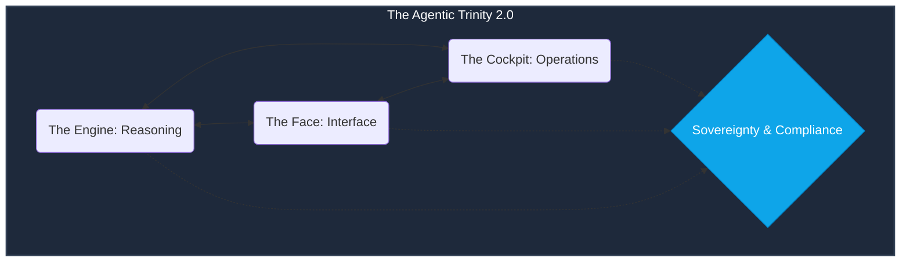

# 🕹️ Technical Guide: AgentOps Audit Suite
## The "Autonomous Architect" Orchestration (v1.3)

The `make audit` command is the heartbeat of the **AgentOps Cockpit**. In v1.3, we have moved beyond "Identification" into **"Autonomous Evolution."** The suite now orchestrates a parallel execution of Specialized SMEs to secure the **Agentic Trinity 2.0**.

---

## 🏗️ The Agentic Trinity 2.0
Every audit is framed against the new Trinity architecture, where **Sovereignty & Compliance** act as a mandatory horizontal layer securing the Engine, Face, and Cockpit.

---

## 🛠️ Audit Lifecycle Commands

| Command | Mode | Persona Focus | Impact |
| :--- | :--- | :--- | :--- |
| `make audit` | **Evaluation** | Dev-velocity: Secrets, Reliability, and Fast Security. | **Build Gate** |
| `make audit-deep` | **Deep Probe** | The "Final Examination": Stress tests, benchmarks, and iterative optimization. | **Prod Ready** |
| `make arch-review`| **Evolution** | v1.3: **Context-Aware Patching** via LLM Synthesis. | **Auto-Hardening** |
| `make simulation-run`| **Digital Twin**| v1.3: 100+ Adversarial User Agents stress-test reasoning.| **Stability Proof** |
| `make bench-cost` | **Economics** | v1.3: Synthetic request simulation for predicted OpEx. | **Margin Baseline** |

👉 **[View Master Command Registry (All Personas)](docs/TECHNICAL_COMMANDS_MASTER.md)**

---

## 🏢 The SME Persona Matrix (v1.3)

### 1. 🔐 SecOps Principal (Sovereign Security)
*   **Mission**: Zero-trust credential hygiene and Multi-Cloud Sovereignty.
*   **Checks**: Scans for secrets and checks the **Sovereignty Score** for vendor lock-in risk.

### 2. 🏛️ Autonomous Architect (Evolution)
*   **Mission**: Systemic integrity and autonomous code synthesis.
*   **v1.3 Shift**: Moves from template fixes to **Context-Aware Patching**, generating PRs that match your project's style.

### 3. 🧗 AI Quality SME (Deep Probe)
*   **Mission**: Iterative prompt optimization (Hill Climbing). 
*   **Mission (Deep Mode)**: Executes 50+ iterations to find the "Optimal System Prompt" that maximizes reasoning accuracy.

### 4. ⚖️ Governance SME (Trinity Compliance)
*   **Mission**: Mandatory horizontal compliance (NIST/SOC2/HIPAA).
*   **Checks**: Validates system prompts against the **Sovereign Gate** policies.

### 5. 💰 FinOps Principal (Economic Analyst)
*   **Mission**: Economic sustainability and "Exit Strategy" TCO.
*   **Checks**: Maps token density to monthly budget and provides the **Open-Source Pivot Plan**.

### 6. 🚩 Red Team Principal (Adversarial SRE)
*   **Mission**: "Reasoning Degradation" detection under pressure.
*   **Mission (Deep Mode)**: Unleashes the full adversarial injection suite, including **Latency Injection** and multilingual jailbreak attempts.

---

## 📊 Comparison: Standard DevOps vs. Autonomous Architect

| Feature | Standard DevOps | AgentOps v1.3 "Autonomous" |
| :--- | :--- | :--- |
| **Fixing Flaws** | Manual Jira tickets. | **LLM-Synthesized PRs (Auto-remediation).** |
| **Scale Test** | Virtual Users (Network). | **Digital Twin Agents (Reasoning Load).** |
| **Cost Control** | Cloud Billing Alerts. | **Predictive Token Density Waterfall.** |
| **Security** | Static Analysis (SAST). | **Adversarial Gaslighting Audits.** |

---

## 📊 The Evidence Bridge (SME Directory)

The audit doesn't just give a "Pass/Fail." It provides **Actionable Intelligence** via specialized technical manuals for each pillar of the Trinity:

*   **Architecture Review**: [`docs/TECHNICAL_ARCH_REVIEW.md`](docs/TECHNICAL_ARCH_REVIEW.md)
*   **AI Quality (Hill Climbing)**: [`docs/TECHNICAL_QUALITY_GUIDE.md`](docs/TECHNICAL_QUALITY_GUIDE.md)
*   **Red Team (Security)**: [`docs/TECHNICAL_REDTEAM_GUIDE.md`](docs/TECHNICAL_REDTEAM_GUIDE.md)
*   **FinOps (Economics)**: [`docs/TECHNICAL_FINOPS_GUIDE.md`](docs/TECHNICAL_FINOPS_GUIDE.md)
*   **Face Auditor (UX/UI)**: [`docs/TECHNICAL_UX_GUIDE.md`](docs/TECHNICAL_UX_GUIDE.md)
*   **AI Infra & SRE**: [`docs/TECHNICAL_INFRA_GUIDE.md`](docs/TECHNICAL_INFRA_GUIDE.md)
*   **A2A Interoperability**: [`docs/TECHNICAL_A2A_GUIDE.md`](docs/TECHNICAL_A2A_GUIDE.md)

---

## 🚀 Usage Scenarios v1.3

### **The "Autonomous Fix" (PR Factory)**
Run `make apply-fixes`. In v1.3, the Cockpit analyzes the AST and synthesizes a patch that follows your specific variable naming and testing patterns, prepping a PR automatically.

### **The "Digital Twin" Simulation**
Run `make simulation-run` before a major launch. Simulating 100 agents helps you identify if the **Engine** starts losing its "Contextual Thread" when database latency spikes in the **Cockpit**.

### **The "GCP LaunchGate" (Deep Mode)**
Run `make audit-deep` before a production deployment. This triggers the **Full Stress Test** and **Deep Red Team** to ensure the system survives enterprise-scale reasoning load.

---
*Generated by the AgentOps Cockpit. Engineering Governance Division.*
