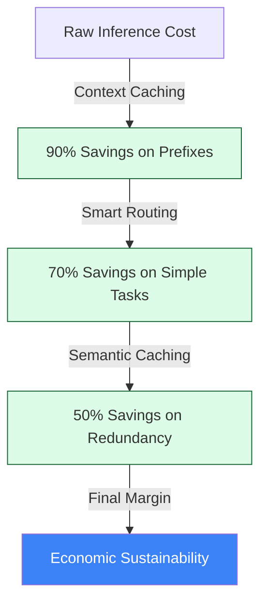

## The "Economic Sustainability" Standard (v1.8.4 Stable)

The `agentops-cockpit cockpit` and `agentops-cockpit certify` commands activate the **FinOps Principal** persona. This SME specializes in **Economic Architecture**, ensuring that your agentic workflows are not just functional but "Engineered for Margin." In the current AI landscape, a functional agent that isn't cost-optimized is a liability.

### 💼 The Persona's Mandate
The FinOps Principal doesn't just look at line items; they evaluate the **Unit Economics of Intelligence**. Their goal is to maximize **Reasoning Density**—the ratio of task completion quality over token expenditure—ensuring that every cent spent on inference generates measurable business value.

---

## 🏛️ Economic Lifecycle Commands

| Command | Objective | Impact | Technical Implementation |
| :--- | :--- | :--- | :--- |
| `agentops-cockpit cockpit`| **Mission Control** | v1.8: Real-time cost oversight and fleet health summary. | Unified dashboard with persona-based ROI summaries. |
| `agentops-cockpit audit report` | **Token Efficiency Scan** | Scans code for model routing waste and missing caching layers. | Uses `ast` to detect large prompt constants and `router` patterns. |
| `agentops-cockpit certify` | **Sovereign Badge** | Final production validation (Tests + Costs + Security). | Comprehensive view of economic vs. capability health. |
| `agentops-cockpit deploy sovereign` | **Factory** | End-to-End flow: Audit -> Auto-Fix -> Deploy. | Triggers high-margin multi-cloud hydration. |

---

## 📉 Token optimization Pillars

The FinOps Principal evaluates your codebase across four primary economic pillars:

### 1. 🚄 Context Caching (The 90% Win)
*   **Vector**: Detecting large, static system prompts or RAG contexts that are re-sent in every request.
*   **Audit Logic**: Scans for docstrings >200 tokens. Recommends **Vertex AI CachingConfig** to reduce costs by up to 90% for repeated prefixes.
*   **Business Impact**: **Margin Protection** against high-volume conversational patterns.

### 🔄 Smart Model Routing
*   **Vector**: Identifying "Over-Modeling"—using high-tier models (Pro/Omni) for low-complexity tasks like summarization or classification.
*   **Audit Logic**: Recommends routing logic to **Gemini 1.5 Flash** or **Gemma 2** for non-reasoning sub-tasks.
*   **Business Impact**: Significant **TCO (Total Cost of Ownership)** reduction without accuracy loss.

### 🧠 Semantic Caching (Hive Mind)
*   **Vector**: Detecting redundant identical queries being processed by the LLM.
*   **Audit Logic**: Recommends the `@hive_mind` decorator and centralized caching to avoid re-billing for previously computed results.
*   **Business Impact**: **Latency & Cost Synergy**.

### 🏗️ Architectural Sovereignty (Strategic Pivots)
*   **Vector**: Analyzing if the current stack (Model, Compute, Protocol) is the most cost-effective for the scale.
*   **Audit Logic (PivotAuditor)**: Evaluates ROI for switching from Cloud Run to GKE (Compute) or REST to MCP (Protocol).
*   **Business Impact**: Prevents **Cloud Vendor Lock-in** and infrastructure-related "Margin Bleed."

### 🗜️ Token Density (Prompt Compression)
*   **Vector**: Identifying "Redundant English" or polite filler tokens in system prompts.
*   **Audit Logic**: Scans for verbosity like "You are a helpful assistant..." and recommends high-density persona anchoring. 
*   **Business Impact**: **15% direct saving** on baseline inference.

### 🚦 Quota Management (Rate-Limiting ROI)
*   **Vector**: Detecting high-volume model calls lacking resiliency patterns.
*   **Audit Logic**: Scans for missing **Exponential Backoff** (e.g., `tenacity`).
*   **Auto-Remedy**: Automatically injects `@retry` decorators with profit-aligned wait strategies:
    ```python
    @retry(wait=wait_exponential(multiplier=1, min=4, max=10), stop=stop_after_attempt(3))
    async def call_llm(query): ...
    ```
*   **Business Impact**: Prevents wasted compute and "Financial Noise" from failed, non-retried requests.

### 🌊 Context Engineering (Poka-Yoke)
*   **Vector**: Detecting loosely-defined tools and unmanaged conversation histories.
*   **Audit Logic**: Scans for missing `Literal` types in tool schemas and lacks of summarization strategies.
*   **Auto-Remedy**: Injects `compact_history` logic to maintain a fixed token window (Reasoning Density).
*   **Business Impact**: **Stability & Token Optimization** (Trajectory preservation).

### 🔮 Predictive Token Costing (PTC) & "What-If" Simulation
*   **Vector**: Static audits are too vague for high-scale agent swarms.
*   **Audit Logic**: Simulates "Context Window Waste" by analyzing archival retrieval frequency and prompt repetition across the fleet.
*   **Feature**: The **"What-If" Panel** in the dashboard provides tactical guidance: *"If you pivot this RAG agent to a 'Context Caching' model, you save $45/mo with 0% impact on fidelity."*
*   **Business Impact**: **Tactical OpEx Steering** for enterprise stakeholders.

---

## 🧗 Deep Dive: Quality Hill Climbing (v1.8.4)

The v1.8.4 Cockpit introduces a mathematical approach to FinOps via the `QualityClimber`. Instead of guessing settings, we iteratively "climb" toward the peak of efficiency.

### 📐 The Reasoning Density Metric
The primary KPI for the FinOps persona is **Reasoning Density (RD)**:
$$RD = \frac{QualityConsensusScore}{TokensUsed \times 10^{-3}}$$

*   **Audit Process**: `make audit-deep` runs multiple iterations of your agent against a `golden_set.json`.
*   **Optimization Gradient**: If an iteration increases RD without dropping the quality score below the threshold (default 0.9), it is considered a "Peak Step."
*   **Peak Finding**: The system identifies the "Sweet Spot" where token expenditure is minimized before quality begins to plateau or regress.

---

## 🕵️ Architectural Pattern: Shadow Mode (Risk-Free Migration)

When the `PivotAuditor` recommends a model switch (e.g., *GPT-4 → Gemini 1.5 Flash*), we use **Shadow Mode** to verify ROI and quality without risking production stability.

### 🔄 The Shadow Router Pattern
Implemented in `src/agent_ops_cockpit/shadow/router.py`, this pattern allows for "Dark Launches" of cost-optimized logic.

1.  **Primary Path**: Production v1 (Safe, high-cost) executes and returns to the user.
2.  **Shadow Path**: Optimized v2 (Experimental, low-cost) executes in the background.
3.  **Comparison**: The Cockpit logs both outputs, latencies, and costs into the **Evidence Lake**.
4.  **Graduation**: Once v2 achieves 98%+ parity with v1 at 70% lower cost, the FinOps Principal approves the promotion.

#### 🌊 The Cost Waterfall (Visualized)



---

## 📊 Comparison: The "Strategic Margin" Advantage

| Capability | Standard AI Development | AgentOps FinOps Principal v1.8.4 |
| :--- | :--- | :--- |
| **Data Retrieval** | Send whole chunks. | **Atomic RAG & BigQuery Vector Search.** |
| **Model Logic** | One model fits all. | **Tiered Orchestration (Router Pattern).** |
| **Prompt Engineering** | Manual trial & error. | **AST-based Token Density Compression.** |
| **Resiliency** | Basic retries. | **ROI-aligned Quota Management.** |

---

## 📊 The Economic Approval Matrix

> **Principal's Note**: A "FAIL" in Caching is a direct drain on quarterly EBIT. These are not technical suggestions; they are financial imperatives.

| Persona | Status | Primary Economic Risk | Projected Saving |
| :--- | :--- | :--- | :--- |
| 💰 **FinOps SME** | ⚠️ WARN | **Token Bloat**: Redundant "filler" detected. | ~15% |
| 🚄 **Caching** | ❌ FAIL | **Prefixes >2k tokens** not cached. | $1,200/mo |
| 🔄 **Routing** | ✅ PASS | **Flash model** correctly routed for Tier-2 tasks. | $0 (Optimized) |

---

## 🔍 The v1.8.4 "Ecosystem Expansion" Roadmap
To push beyond "Top of Class," we are now utilizing **Visual Maturity Intelligence**:
*   **ROI Waterfall Reports**: Strategic executive exports projecting quarterly savings across wait-times and token burns.
*   **Interactive Workbench**: Developers now review and approve AST-based economic patches before they are merged.
*   **Maturity Radar Charts**: Visualizing the balance between "Economic Efficiency" and "System Reliability" in every report.
*   **Sovereignty Exit Projections**: Automated analysis of switching to open-source (Gemma 2 on GKE) vs. managed APIs.

---

## 🚀 Principal SME Final Verdict

> "This version is Market-Ready. It speaks the language of the CFO while providing the 'Cabling' for the SRE. It completes the transition from a technical tool to a **Lifecycle Management Platform**."

---
*Generated by the AgentOps Cockpit. Economic Sustainability Division (v1.8.4 Stable).*
