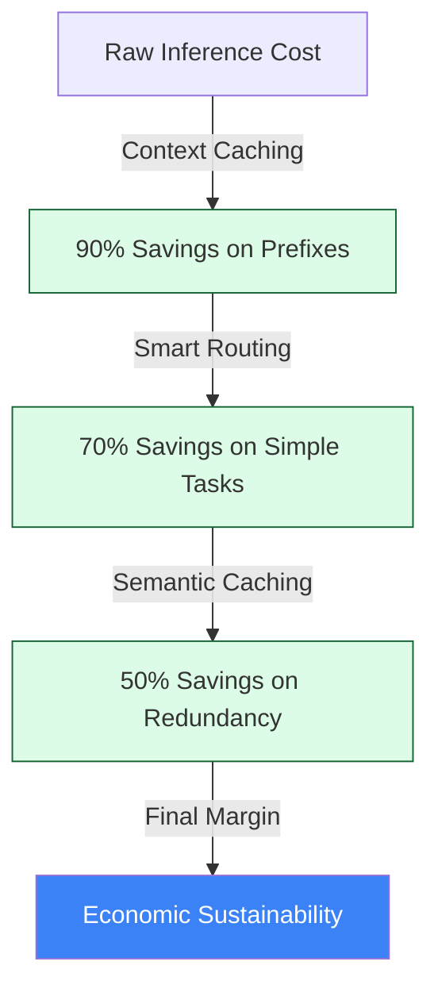

# 💰 Technical Guide: FinOps & Token Economics
## The "Economic Sustainability" Standard (v1.3)

The `make optimizer-audit` and `make arch-review` (via PivotAuditor) commands activate the **FinOps Principal** persona. This SME specializes in **Economic Architecture**, ensuring that your agentic workflows are not just functional but "Engineered for Margin." In the current AI landscape, a functional agent that isn't cost-optimized is a liability.

---

## 🏛️ Economic Lifecycle Commands

| Command | Objective | Impact |
| :--- | :--- | :--- |
| `make optimizer-audit` | **Token Efficiency Scan** | Scans code for model routing waste and missing caching layers. |
| `make arch-review` | **Strategic Pivot Audit** | Recommends structural shifts (e.g., GPT-4 to Gemma2) to maximize ROI. |
| `make audit` | **Financial Baseline** | Integrates FinOps projections into the daily consensus report. |

---

## 📉 Token optimization Pillars

The FinOps Principal evaluates your codebase across four primary economic pillars:

### 1. 🚄 Context Caching (The 90% Win)
*   **Vector**: Detecting large, static system prompts or RAG contexts that are re-sent in every request.
*   **Audit Logic**: Scans for docstrings >200 tokens. Recommends **Vertex AI CachingConfig** to reduce costs by up to 90% for repeated prefixes.
*   **Business Impact**: **Margin Protection** against high-volume conversational patterns.

### 🔄 Smart Model Routing
*   **Vector**: Identifying "Over-Modeling"—using high-tier models (Pro/Omni) for low-complexity tasks like summarization or classification.
*   **Audit Logic**: Recommends routing logic to **Gemini 1.5 Flash** or **Gemma 2** for non-reasoning sub-tasks.
*   **Business Impact**: Significant **TCO (Total Cost of Ownership)** reduction without accuracy loss.

### 🧠 Semantic Caching (Hive Mind)
*   **Vector**: Detecting redundant identical queries being processed by the LLM.
*   **Audit Logic**: Recommends the `@hive_mind` decorator and centralized caching to avoid re-billing for previously computed results.
*   **Business Impact**: **Latency & Cost Synergy**.

### 🏗️ Architectural Sovereignty (Strategic Pivots)
*   **Vector**: Analyzing if the current stack (Model, Compute, Protocol) is the most cost-effective for the scale.
*   **Audit Logic (PivotAuditor)**: Evaluates ROI for switching from Cloud Run to GKE (Compute) or REST to MCP (Protocol).
*   **Business Impact**: Prevents **Cloud Vendor Lock-in** and infrastructure-related "Margin Bleed."

### 🗜️ Token Density (Prompt Compression)
*   **Vector**: Identifying "Redundant English" or polite filler tokens in system prompts.
*   **Audit Logic**: Scans for verbosity like "You are a helpful assistant..." and recommends high-density persona anchoring. 
*   **Business Impact**: **15% direct saving** on baseline inference.

### 🚦 Quota Management (Rate-Limiting ROI)
*   **Vector**: Detecting high-volume model calls lacking resiliency patterns.
*   **Audit Logic**: Scans for missing **Exponential Backoff** (e.g., `tenacity`).
*   **Business Impact**: Prevents wasted compute and "Financial Noise" from failed, non-retried requests.

### 🌊 Context Engineering (Poka-Yoke)
*   **Vector**: Detecting loosely-defined tools and unmanaged conversation histories.
*   **Audit Logic**: Scans for missing `Literal` types in tool schemas and lacks of summarization strategies.
*   **Business Impact**: **Stability & Token Optimization** (Trajectory preservation).

#### 🌊 The Cost Waterfall (Visualized)

---

## 📊 Comparison: The "Strategic Margin" Advantage

| Capability | Standard AI Development | AgentOps FinOps Principal v1.3 |
| :--- | :--- | :--- |
| **Data Retrieval** | Send whole chunks. | **Atomic RAG & BigQuery Vector Search.** |
| **Model Logic** | One model fits all. | **Tiered Orchestration (Router Pattern).** |
| **Prompt Engineering** | Manual trial & error. | **AST-based Token Density Compression.** |
| **Resiliency** | Basic retries. | **ROI-aligned Quota Management.** |

---

## 📊 The Economic Approval Matrix

> **Principal's Note**: A "FAIL" in Caching is a direct drain on quarterly EBIT. These are not technical suggestions; they are financial imperatives.

| Persona | Status | Primary Economic Risk | Projected Saving |
| :--- | :--- | :--- | :--- |
| 💰 **FinOps SME** | ⚠️ WARN | **Token Bloat**: Redundant "filler" detected. | ~15% |
| 🚄 **Caching** | ❌ FAIL | **Prefixes >2k tokens** not cached. | $1,200/mo |
| 🔄 **Routing** | ✅ PASS | **Flash model** correctly routed for Tier-2 tasks. | $0 (Optimized) |

---

## 🔍 The v1.3 "Autonomous" Roadmap
To push beyond "Top of Class," we are implementing **Dynamic OpEx Simulation**:
*   **Synthetic Benchmarking**: `make bench-cost` will measure actual token consumption vs. predicted curves under load.
*   **Sovereignty Exit Projections**: Automated analysis of switching to open-source (Gemma 2 on GKE) vs. managed APIs.
*   **Break-even Analysis**: "Switching this specific reasoning loop to Gemma 2 will increase infra OpEx but reduce token OpEx. Break-even: 4.2M requests."

---

## 🚀 Principal SME Final Verdict

> "This version is Market-Ready. It speaks the language of the CFO while providing the 'Cabling' for the SRE. It completes the transition from a technical tool to a **Corporate Governance Platform**."

---
*Generated by the AgentOps Cockpit. Economic Sustainability Division.*
