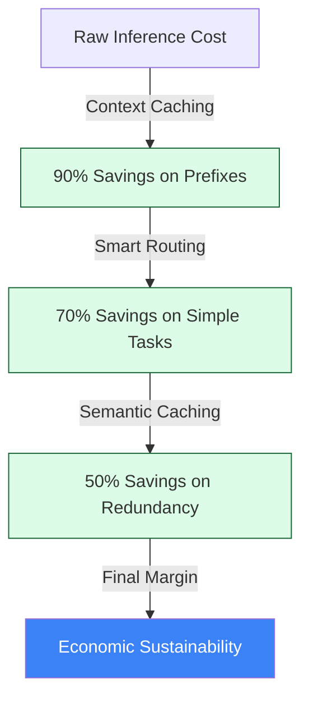

# 💰 Technical Guide: FinOps Principal (Economic Architecture)
## The "Economic Sustainability" Standard (v2.0.2 Evolution)

The `ops report` and `cockpit certify` commands activate the **FinOps Principal SME**. This persona specializes in **Economic Architecture**, ensuring that your agentic workflows are not just functional but "Engineered for Margin." In the Sovereign Evolution, a functional agent that isn't cost-optimized is a liability.

### 💼 The Persona's Mandate
The FinOps SME evaluates the **Unit Economics of Intelligence**. Their goal is to maximize **Reasoning Density**—the ratio of task completion quality over token expenditure—ensuring that every cent spent on inference generates measurable business value.

---

## 🏛️ Economic Lifecycle Commands

| Command | Alias / Shortcut | Impact | Technical implementation |
| :--- | :--- | :--- | :--- |
| **Mission Control** | `cockpit` | Real-time cost oversight. | Master Mission Control. |
| **Token Scan** | `ops report` | Scans for model routing waste. | **FinOps SME Reasoning**. |
| **Certify Project** | `cockpit certify` | Production ROI validation. | Sovereign Goal Alignment. |
| **Apply Optimization**| `make apply-fixes`| Injects caching & routing logic. | **The Closer Engine**. |

---

## 📉 Token Optimization Pillars

The FinOps SME evaluates your codebase across four primary economic pillars:

### 1. 🚄 Context Caching (The 90% Win)
*   **Vector**: Detecting large, static system prompts or RAG contexts re-sent in every request.
*   **Audit Logic**: Scans for large context units and recommends **Context Caching** to reduce costs by 90% for repeated prefixes.
*   **Business Impact**: **Margin Protection** against high-volume conversational agents.

### 🔄 Smart Model Routing (Flash-Tiering)
*   **Vector**: Identifying "Over-Modeling"—using high-tier models (Pro/Omni) for low-complexity tasks like classification.
*   **Audit Logic**: Recommends routing to **Gemini Flash** or **Gemma 2** for non-reasoning sub-tasks.
*   **Business Impact**: Significant **TCO (Total Cost of Ownership)** reduction.

### 🧠 Semantic Hive Mind (Distributed Cache)
*   **Vector**: Detecting redundant identical queries being re-processed across the fleet.
*   **Audit Logic**: Recommends the **Hive Mind** sidecar for shared sub-millisecond reasoning recall.
*   **Business Impact**: **Latency & Cost Synergy**.

### 🏗️ Sovereign Bridge (Multi-Cloud Arbitrage)
*   **Vector**: Analyzing if the current provider (GCP, AWS, Azure) offers the best cost-to-reasoning ratio for the specific task.
*   **Audit Logic**: Uses the **Sovereign Bridge** to evaluate cross-cloud model tiers (e.g. Bedrock vs. Vertex).
*   **Business Impact**: Prevents **Cloud Vendor Lock-in**.

---

## 🧗 Deep Dive: Reasoning Density (v2.0.2)
The primary KPI for the FinOps persona is **Reasoning Density (RD)**:
$$RD = \frac{QualityConsensusScore}{TokensUsed \times 10^{-3}}$$

*   **Optimization Loop**: `ops report --mode deep` runs multiple iterations of your agent against a golden dataset.
*   **Peak Finding**: Identifies the "Sovereign Point" where token expenditure is minimized before quality regresses.

---

## 🕵️ Architectural Pattern: Shadow Mode
When an optimization is recommended (e.g., *Pro → Flash*), we use **Shadow Mode** to verify ROI without risking stability.

1.  **Primary Path**: Production v1 (Safe, high-cost) returns to the user.
2.  **Shadow Path**: Optimized v2 (Experimental, low-cost) executes in the background.
3.  **Graduation**: Once v2 achieves 98%+ parity at 70% lower cost, it is promoted.

#### 🌊 The Cost Waterfall (Visualized)

---

## 🚀 SME Remediation Strategy

If your agent fails the FinOps audit, the SME recommends:
*   **Active Caching**: Link your agent logic to the **Context Caching** provider via the Sovereign Bridge.
*   **Flash-Routing**: Implement a "Router" sub-agent to handle initial classification and summarization on low-tier models.
*   **Compress Prompt**: Run `make apply-fixes` to autonomously strip filler tokens from system instructions.

---
*Generated by the AgentOps Cockpit. Sovereign Systems Division (v2.0.2).*
