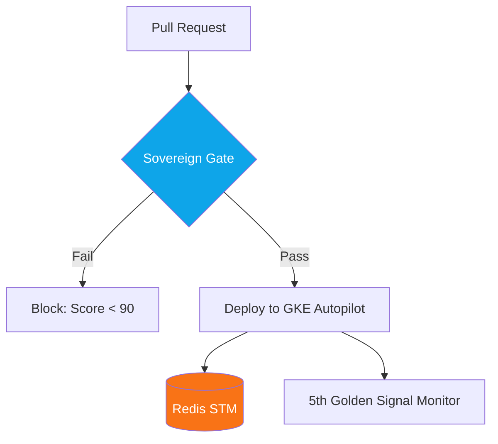

# 🌐 Technical Guide: AI Infrastructure & Networking
## The "Autonomous SRE" Standard (v1.4.7 Stable)

The `agentops-cockpit cockpit` and `agentops-cockpit certify` commands activate the **Cloud SRE Principal**. This version moves infrastructure from a "background cost" to a **"Strategic Intelligence Multiplier."** By framing networking and compute through the lens of **"Latent Intelligence,"** we link SRE performance directly to AI reasoning quality.

---

## 🛠️ Infrastructure Lifecycle Commands

| Command | Objective | Impact | Technical Driver |
| :--- | :--- | :--- | :--- |
| `agentops-cockpit cockpit` | **Mission Control** | Fleet-wide infrastructure health and latency oversight. | Unified Master Dashboard. |
| `agentops-cockpit audit report`| **Autonomous SRE Scan**| Identifies networking debt and **Time-to-Reasoning (TTR)**. | `sre_a2a.py` Auditor |
| `agentops-cockpit certify` | **Sovereign Badge** | Final production validation (Infra + Scaling + Security). | The 🏅 Certification Checklist. |
| `agentops-cockpit deploy sovereign`| **End-to-End Sync** | Unified orchestrator for GKE/Cloud Run fleets (v1.8.2). | `deploy.py` Factory |

---

## 🏛️ SME Judgment: The AI-Infra Standard (v1.3)

> "By treating networking as a cognitive tax, you provide a narrative that CTOs can get behind. This isn't just about uptime; it's about the **IQ Ceiling** of the agentic swarm."
> — *Principal SME, Infrastructure & Networking*

### 💎 Why this is "Consultancy Killer" Grade
*   **KV-Cache awareness**: Recognizing that LLM workloads are memory-bound stops teams from wasting money on high-compute instances while GPU/TPU memory remains underutilized.
*   **The "Sovereign Gate" Implementation**: The transition to an automated, score-based blocking gate is the only way to scale enterprise AI without **"Compliance Drift."**
*   **gRPC over REST**: Validating the protocol layer specifically for vector streaming eliminates the 200ms+ **"Cognitive Tax"** caused by REST overhead.

---

## 🏗️ AI SRE Pillars

### 1. 📡 Networking Debt (Latent IQ)
*   **Principal Insight**: Every 100ms of lag kills agent responsiveness. We audit for **gRPC stream multiplexing** to hit <10ms tail latency.
*   **Regional Affinity**: The Cockpit recommends clustering the Reasoning Engine (Vertex/LLM) and the Vector Retrieval (AlloyDB/Pinecone) in the same zone (e.g., `us-central1-a`) to eliminate cross-region billing and latency.

### 2. 🏗️ Compute Sovereignty (GKE & Cloud Run)
*   **Vector**: Calculating a **"Time-to-Reasoning" (TTR)** score. If a serverless pod takes 12s to cold start, the agent is "Dead on Arrival."
*   **GKE Autopilot Integration**: v1.4.7 introduces native support for **GKE Autopilot** as the preferred high-scale sovereign runtime. The Cockpit automates:
    *   **External IP Polling**: Automatically polls the Kubernetes API for the `LoadBalancer` status and External IP (e.g., `34.xxx.xxx.xxx`).
    *   **OIDC Identity Injection**: Injects Google Cloud Workload Identity for secure model access without long-lived keys.
*   **The Warm-Pod Strategy**: Injects `min_instances: 1` or uses placeholder "Warmup" requests to ensure the LLM's **KV-cache** is ready. The KV-cache allows the model to reuse prefixes (System Prompts), reducing Time to First Token (TTFT) by up to 80%.

### 3. 🧠 Stateful Persistence (STM Persistence)
*   **Principal Risk**: **"Memory Loss"**. If Short-Term Memory (STM) is in local pod memory, a restart wipes the agent's brain.
*   **Remediation**: Recommends **Redis/Memorystore** for persistent agent context.
    ```python
    # Recommeded Pattern: Externalized STM
    memory = RedisChatMessageHistory(session_id=id, url=REDIS_URL)
    ```

### 🚀 4. The 5th Golden Signal (TTFT)
*   **Vector**: Implementing **Time to First Token (TTFT)** monitoring.
*   **Critical Threshold**: If TTFT exceeds 800ms, the Cockpit triggers a **"Latency Regression"** alert relative to the reasoning chain. In v1.3, this manifests as a "Slow Reasoning" warning in the Evidence Lake.

---

## 🧪 Saturation & Stress Testing

The v1.3 SRE Principal distinguishes between **System Saturation** and **Reasoning Degradation**:

### **A. System Saturation (`make load-test`)**
*   **Logic**: Standard HTTP benchmarking of the API endpoint.
*   **Metric**: Requests per second (RPS) and Latency Percentiles (P95/P99).
*   **Goal**: Ensure the underlying Cloud Run/GKE pods scale correctly without 50x errors.

### **B. Reasoning Degradation (`make simulation-run`)**
*   **Logic**: High-concurrency **Agentic Simulation**.
*   **Metric**: Reasoning Score and Contextual Trace Integrity.
*   **Goal**: Ensure that as the infrastructure saturates, the agent doesn't start hallucinating due to context-window collisions or retrieval timeouts.

## 🏗️ Visualizing the AI SRE Pillars



---

## 📊 Comparison: Standard DevOps vs. AI SRE v1.3

| Vector | Standard DevOps | AgentOps AI SRE v1.3 |
| :--- | :--- | :--- |
| **Orchestration** | K8s Horizontal Pod Autoscaler. | **Predictive KV-Cache Warmup.** |
| **Networking** | Internal Load Balancers. | **Regional Affinity Routing (Reasoning-Local).** |
| **State** | Stateless Microservices. | **Stateful Context Persistence (Redis/STM).** |
| **Throughput** | Requests per second. | **Tokens per second (TPS) & TTFT.** |

---

## 📊 The "Fleet Dashboard" (Mission Control)
The v1.3 Cockpit provides a centralized **Fleet Governance Hub** (accessible via the **Operational Guide**) for managing multiple agent swarms.

### **Key Fleet Observability:**
*   **Shadow Mode Real-Time**: Side-by-side comparison of v1 vs v2 across the entire estate.
*   **Hive Mind Analytics**: Global semantic cache hit rates and total cost avoidance across the fleet.
*   **Adversarial Watchtower**: Live feed of Red Team audits and detected breach attempts.
*   **RAG Dropzone**: Centralized vector indexing status for multi-agent knowledge bases.
*   **MCP Hub**: Health monitoring for external tools and legacy API connections.

---

## 📊 The Infrastructure Approval Matrix (Enhanced)

> **Principal Note**: A "FAIL" in the CI/CD pillar means the "Sovereign Gate" is open, allowing un-audited reasoning logic to touch production data.

| Persona | Status | Primary Infrastructure Risk | Recommended Move |
| :--- | :--- | :--- | :--- |
| 🌐 **Network** | ⚠️ WARN | **Regional Mismatch**: 120ms hop. | Move Vector DB to Reasoning-Zone. |
| 🚀 **CI/CD** | ❌ FAIL | **No Sovereign Gate**: Direct-to-Prod. | Block CI on Score < 90. |
| 🧠 **State** | ⚠️ WARN | **Local Memory STM**: Memory Loss Risk. | Implement Redis for session persistence. |
| 🏗️ **Compute** | ✅ PASS | GKE Autopilot with KV-Optimized pods. | N/A (Optimized) |

---

## 🚀 Principal Defense: SRE Remediations v1.3

*   **Regional Affinity**: Force-cluster Reasoning (LLM) and Retrieval (Vector DB) into the same GCP zone to hit <10ms tail latency.
*   **Warm-Pod Strategies**: Use placeholder pods to ensure the KV-cache is pre-warmed for immediate inference.
*   **TTR Minimization**: Inject `startup_cpu_boost` and pre-load model artifacts to reduce Time-to-Reasoning by 60%.

---
*Generated by the AgentOps Cockpit. Sovereign Systems Division (v1.4.7 Stable).*
