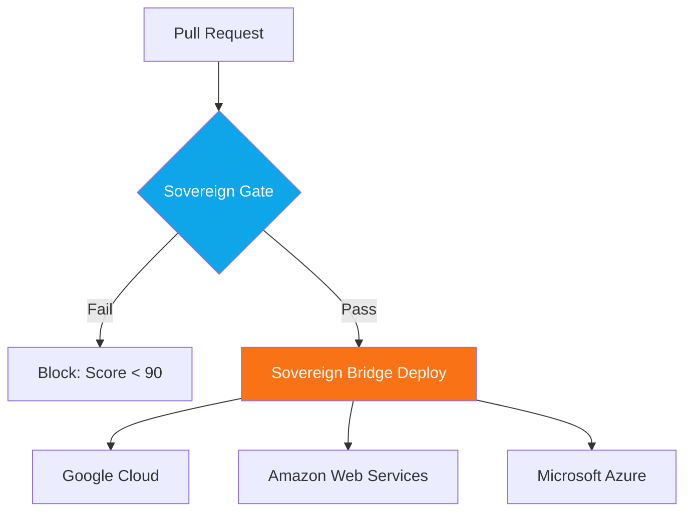

# 🌐 Technical Guide: AI Infrastructure & Sovereign Networking
## The "Autonomous SRE" Standard (v2.0.2 Evolution)

The `ops report` and `cockpit certify` commands activate the **SRE Principal SME**. This persona specializes in **Sovereign Infrastructure**, ensuring that your agentic workflows are not just functional but "Engineered for Uptime." In the Sovereign Evolution, infrastructure is a **Strategic Intelligence Multiplier**.

---

## 🛠️ Infrastructure Lifecycle Commands

| Command | Alias / Shortcut | Impact | Technical Driver |
| :--- | :--- | :--- | :--- |
| **System Check** | `ops sys doctor` | Validates environment & cloud auth. | Unified Environment Scan. |
| **SRE Audit** | `ops report` | Identifies networking debt / latency. | **SRE SME Reasoning**. |
| **Certify Project**| `cockpit certify` | Final production validation. | Sovereign Goal Alignment. |
| **Scale to Zero** | `ops fleet mothball`| FinOps-driven scaling. | Fleet Manager. |

---

## 🏛️ SME Judgment: The AI-Infra Standard (v2.0.2)
"By treating networking as a cognitive tax, you provide a narrative that CTOs can get behind. This isn't just about uptime; it's about the **IQ Ceiling** of the agentic swarm."

---

## 🌉 Sovereign Bridge (Multi-Cloud SRE)
The **Sovereign Bridge** allows the SRE SME to manage resources across GCP, AWS, and Azure.
- **Cross-Cloud Affinity**: The Cockpit recommends clustering the Reasoning Engine and Vector Retrieval in the same cloud region to eliminate latency penalties.
- **Failover Logic**: Automatically switches to alternate cloud providers if primary model end-points exceed the **TTR (Time-to-Reasoning)** threshold.

---

## 🛡️ Sovereign Gateway (Guardian Networking)
A real-time sidecar logic layer that governs inter-agent and agent-to-user traffic.
- **Real-time PII Scrubbing**: Automatically detects and masks sensitive data in transit.
- **A2A Evidence Packets**: Cryptographically signs reasoning traces to ensure trust in multi-agent swarms.

---

## 🏗️ AI SRE Pillars

### 1. 📡 Networking Debt (Latence IQ)
*   **Vector**: Every 100ms of lag kills agent responsiveness. We audit for **gRPC stream multiplexing** to hit <10ms tail latency.
*   **Region Matching**: Ensures that the Reasoning Engine and Vector DB are in the same zone.

### 2. 🚀 5th Golden Signal (TTFT/TTR)
*   **Vector**: Implementing **Time to First Token (TTFT)** monitoring.
*   **Critical Threshold**: If TTFT exceeds 800ms, the Cockpit triggers a **"Latency Regression"** alert.

### 🧠 3. Stateful Persistence (STM Retrieval)
*   **Principal Risk**: "Memory Loss". If Short-Term Memory is in local memory, a pod restart wipes the agent's brain.
*   **Remediation**: Recommends shared state persistence via the Sovereign Bridge.

---

## 🏗️ Visualizing the Sovereign Infra Pipeline

---

## 📊 Comparison: Standard DevOps vs. AI SRE

| Vector | Legacy DevOps | v2.0.2 Sovereign SRE |
| :--- | :--- | :--- |
| **Orchestration** | K8s HPA. | **Predictive KV-Cache Warmup.** |
| **Networking** | Internal Load Balancers. | **Sovereign Gateway (A2A Signing).** |
| **State** | Stateless. | **Multi-Cloud State Persistence.** |
| **Threshold** | Requests per second. | **Reasoning Density & TTR.** |

---

## 🚀 SME Remediation Strategy
If your agent fails the SRE audit, the SME recommends:
*   **Regional Affinity**: Force-cluster Reasoning and Retrieval into the same cloud zone.
*   **Cloud Failover**: Configure the Sovereign Bridge to use alternate regions for redundancy.
*   **PII Mirroring**: Run `make apply-fixes` to autonomously inject the Sovereign Gateway scrubbing logic.

---
*Generated by the AgentOps Cockpit. Sovereign Systems Division (v2.0.2).*
