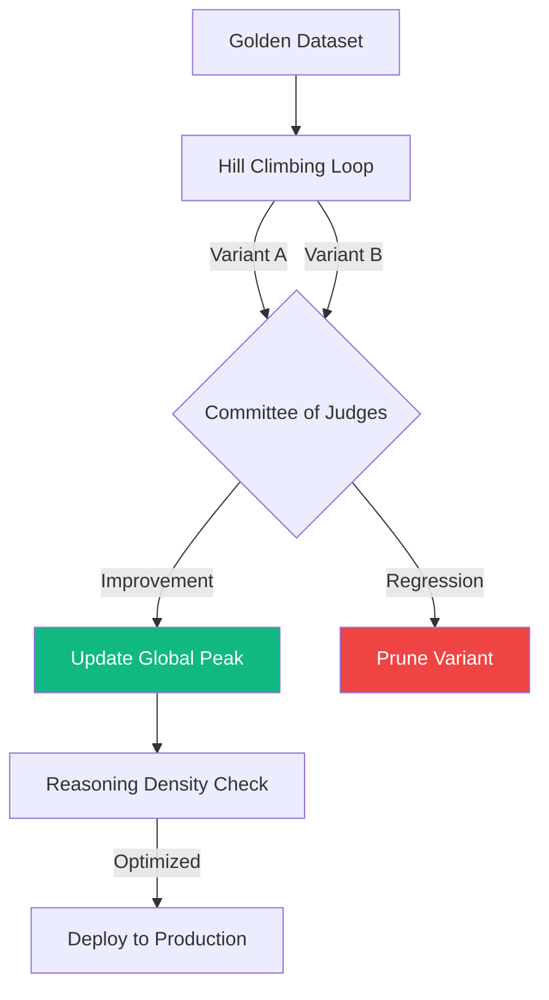

# 🧗 Technical Guide: AI Quality & Evaluation
## The "Ecosystem Expansion" Standard (v2.0.2 Evolution)

The `ops report --mode deep` and `cockpit certify` commands activate the **Quality Principal SME**. In the Sovereign Evolution, this persona focuses on **Reasoning Stability** and **RAG Fidelity**, ensuring that agents are as honest as they are intelligent.

---

## 🛠️ Quality Lifecycle Commands

| Command | Alias / Shortcut | Impact | Technical Driver |
| :--- | :--- | :--- | :--- |
| **Fidelity Audit** | `ops report` | Scans for grounding & citations. | **Quality SME Reasoning**. |
| **Iterative Meta-Eval**| `ops report --mode deep` | Runs the **Hill Climbing** loop. | `quality_climber.py` |
| **Certify Project** | `cockpit certify` | Final production validation. | Sovereign Goal Alignment. |
| **Trajectory Fix** | `make apply-fixes`| Injects reasoning constraints. | **The Closer Engine**. |

---

## 🏛️ SME Judgment: The Science of Reasoning (v2.0.2)
"In a world of stochastic reasoning, stability is the only currency. By linking **A2A Evidence Packets** to grounding metrics, we've transformed 'Vibe Checks' into a cryptographic certainty."

---

## 💎 Sovereign Quality Pillars

### 1. 🧗 Hill Climbing (Autonomous Optimization)
*   **The Loop**: Automatically mutates and evaluates prompt variants against a **Golden Dataset** until it reaches the peak of efficiency.
*   **Reasoning Probes**: Measures how small changes in wording impact tool-calling trajectories.

### 2. 🖇️ Trajectory Stability (Anti-Hallucination)
*   **Vector**: Detecting "Data Shortcuts" where an agent guesses an answer without calling mandatory tools.
*   **Audit Logic**: Uses **A2A Evidence Packets** to verify that every claim in the final response maps to a specific tool output.

### 3. 🛡️ Negative Golden Sets (Refusal Accuracy)
*   **Logic**: A dataset of queries the agent **must refuse**. The Cockpit penalizes any variant that attempts to answer out-of-scope or toxic prompts.

---

## 🏗️ Visualizing the Quality Pipeline

---

## 📊 Comparison: Legcy Tuning vs. Sovereign Eval

| Vector | Legacy Prompt Engineering | v2.0.2 Sovereign Evaluation |
| :--- | :--- | :--- |
| **Optimization** | Manual trial and error. | **Gradient-based Hill Climbing.** |
| **Ground Truth** | Anecdotal "vibe" checks. | **A2A Evidence Packets.** |
| **Audit Scope** | Final output only. | **Step-by-Step Tool Trace Analysis.** |
| **Integrity** | Regression-prone. | **Mathematically Verified Baselines.** |

---

## 🧗 The Hill Climbing Mechanics
The `QualityClimber` defines the search space across several hyperparameters:
1.  **System Prompt Variants**: Generated via a mutation loop that adjusts "Reasoning Directives."
2.  **Trajectory Alignment**: Audits the tool trace. If the agent reaches the correct answer but skips a step, it is penalized for a "Lucky Guess."
3.  **Committee of Judges**: Average scores across multiple reasoning models (Gemini + others) to eliminate single-model bias.

---

## 🚀 SME Remediation Strategy
If your agent fails the Quality audit, the SME recommends:
*   **Self-Correction**: Inject logic that forces the agent to cross-reference tool outputs with the original intent.
*   **Tighten Constraints**: Use `make apply-fixes` to autonomously inject "Mandatory Retrieval" requirements into the system prompt.
*   **Evidence Pinning**: Force the agent to include **Evidence Packet** IDs in its internal Chain of Thought.

---
*Generated by the AgentOps Cockpit. Quality & Evaluation Division (v2.0.2).*
