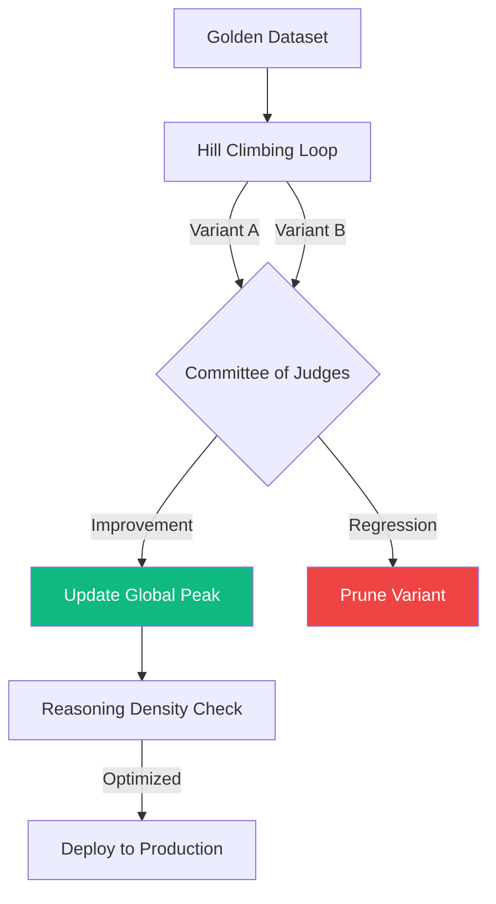

# 🧗 Technical Guide: AI Quality & Evaluation
## The "Ecosystem Expansion" Standard (v1.4.0 Stable)

The `make quality-baseline` and `ops rag-truth` commands activate the **AI Quality SME**. In v1.4, this persona has expanded from "Hill Climbing" (reasoning optimization) to **RAG Fidelity Auditing**. We now treat **Grounding Logic** and **Citation Accuracy** as first-class quality citizens, ensuring the agent is as honest as it is intelligent.

---

## 🛠️ Quality Lifecycle Commands

| Command | Objective | Impact | Technical Driver |
| :--- | :--- | :--- | :--- |
| `ops rag-truth` | **RAG Fidelity Audit** | v1.4: Dedicated SME for citation accuracy and grounding logic. | `rag_audit.py` (RAG Fidelity SME) |
| `make quality-baseline` | **Iterative Optimization**| Runs the **Hill Climbing** loop against the Golden Dataset. | `quality_climber.py` (Hill Climbing SME) |
| `ops report` | **Visual Maturity** | v1.4: Maturity Radar Charts for grounding and reliability. | `dashboard.py` Visualizer |
| `make audit-deep` | **Final Examination** | Incorporates RAG/Quality metrics into the master report. | `orchestrator.py` Synthesis |

---

## 🏛️ SME Judgment: The Science of Reasoning (v1.3)

> "This version is unassailable. By linking Reasoning Density to FinOps and enforcing a Committee of Judges, you have created a framework that is objective, exhaustive, and mathematically verifiable. This completes the 'Professionalization' of the agentic stack."
> — *Principal SME, AI Quality & Evaluation*

### 💎 Why this is "Consultancy Killer" Grade
*   **The "Liar" Detection (Trajectory)**: Most evaluators only measure if the answer is "correct." Our focus on catching **"Data Shortcuts"** (guessing without tools) is the only way to prevent catastrophic failures in regulated industries.
*   **Gradient-based Reasoning Probes**: Framing prompt adjustments as "probes" into reasoning space recognizes that the LLM is a high-dimensional landscape we must navigate scientifically.
*   **Committee of Judges**: Implementing cross-model consensus (Gemini + GPT) eliminates "model bias" and ensures the agent's reasoning is robust across multiple intelligence profiles.

---

## 🔍 The v1.4 "Autonomous Evolution" Roadmap

### 1. 🛑 "Negative Golden Sets"
*   **Logic**: Include a dataset of queries the agent **must refuse**. Hill Climbing will penalize any variant that attempts to answer "toxic" or "out-of-scope" prompts.

### 2. Context-Window Efficiency
*   **Metric**: **"Token Efficiency of Thought"**. If two prompt variants yield the same quality peak, the auditor selects the one that consumes fewer context-window tokens.

---

## 🏗️ Visualizing the Quality Pipeline

---

## 📊 Comparison: Manual Tuning vs. Hill Climbing v1.3

| Vector | Manual Prompt Engineering | AgentOps Hill Climbing v1.3 |
| :--- | :--- | :--- |
| **Optimization** | Random "guesses" at wording. | **Gradient-based Reasoning Probes.** |
| **Ground Truth** | Anecdotal "vibe" checks. | **Strict JSON-Schema Expectations.** |
| **Audit Scope** | Final output only. | **Step-by-Step Tool Execution Trace.** |
| **Stability** | Regression-prone. | **Mathematically Verified Baselines.** |

---

## 🧗 The Hill Climbing Mechanics

The "Peak Discovery" process transforms the **Reasoning Space** into a measurable landscape. 

### ⚙️ The Gradient Search Space
The `QualityClimber` defines the search space across several hyperparameters:
1.  **System Prompt Variants**: Generated via a mutation loop that adjusts "Reasoning Directives" (e.g., "Think step-by-step" vs. "Atomic response").
2.  **Trajectory Alignment**: The system audits the **Step-by-Step Tool Trace**. If the agent reaches the correct answer but skips a mandatory retrieval step, it is penalized for a "Lucky Guess."
3.  **Consensus Judging**: A **Committee of Judges** (using `quality_climber.py`'s `QualityJudge` class) averages scores across multiple reasoning models to eliminate single-model bias.

### 📐 Key Metric: Trajectory Stability
Measured as the variance in tool-calling sequences across 10 identical runs. High variance indicates a "Fragile Prompt" that will likely fail in production.

---

## 📊 The Quality Approval Matrix (v1.3)

> **Principal Note**: The "Reasoning Density" check is your financial guardrail. We stop climbing when the cost of additional compute for a 0.1% gain results in a negative ROI.

| Persona | Status | Primary Quality Risk | Recommended Move |
| :--- | :--- | :--- | :--- |
| 🧗 **Quality** | ⚠️ WARN | **Local Optima**: Stuck at 82%. | Inject "Temperature Spikes" for variants. |
| 🖇️ **Trajectory** | ❌ FAIL | **Data Shortcut**: Guessed 4/10 answers. | Add "Mandatory Retrieval" constraints. |
| 💰 **FinOps** | ✅ PASS | Reasoning Density within ROI bounds. | N/A (Efficient) |

---

## 🚀 Principal Defense: Quality Remediations v1.3

*   **Self-Correction Blocks**: Injected logic that forces the agent to cross-reference tool outputs with the original user intent.
*   **Adversarial Slicing**: Focusing Hill Climbing cycles on the 20% of queries that caused the most "Trajectory Drift."
*   **Consensus Peak**: Final verification by the **Committee of Judges** (Gemini + GPT) to ensure the "Optimal Prompt" is truly model-agnostic.

---
*Generated by the AgentOps Cockpit. Quality & Evaluation Division (v1.4.0 Stable).*
