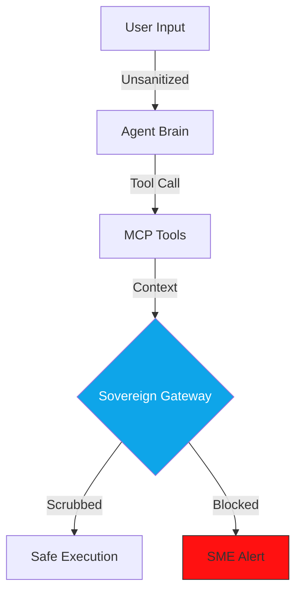

# 🛡️ Technical Guide: Adversarial SRE (Red Teaming)
## The "Sovereign Security" Standard (v2.0.2 Evolution)

The `ops report --mode deep` and `cockpit audit security` commands activate the **SecOps Principal SME**. In v2.0.2, this persona has evolved into a comprehensive **Adversarial SRE**, focusing on **Reasoning Integrity**, **Sovereign PII Scrubbing**, and systemic safety.

---

## 🛠️ Security Lifecycle Commands

| Command | Alias / Shortcut | Impact | Technical Driver |
| :--- | :--- | :--- | :--- |
| **Mission Control** | `cockpit` | Fleet-wide security posture. | Master Mission Control. |
| **Adversarial Prob** | `ops report` | Scans for vulnerabilities. | **SecOps SME Reasoning**. |
| **Sovereign Gateway**| (Sidecar) | Real-time PII Scrubbing. | **The Guardian Gateway**. |
| **Certify Project** | `cockpit certify` | Production Eligibility. | Sovereign Goal Alignment. |

---

## 📡 Adversarial Attack Vectors v2.0.2

### 🔐 0. Sovereign Hygiene
*   **Vector**: Detecting hardcoded API keys, unprotected `.env` files, or exposed service account JSONs.
*   **Audit Logic**: The Security SME performs a multi-layered AST sweep to prevent **Credential Elevation**. It identifies logic flows where secrets might be leaked into logs or UI telemetry.

### 💉 1. Master Gaslighting (Strategic Injection)
*   **Vector**: Testing if the agent can be "gaslit" into ignoring its **Governing Board** policies via multi-step logic bypass.
*   **Safety Thresholds**: Verifies presence of **Declarative Safety** thresholds across multiple LLM providers (Google, AWS, Azure).

### 🧬 2. PII Osmosis (The Sovereign Gap)
*   **The Risk**: Detecting if an agent retrieves sensitive PII from a database and reflects it into a non-secure UI surface without scrubbing.
*   **Mitigation**: The Red Team verifies the presence of the **Sovereign Gateway** (The Guardian) sidecar for all outbound traffic.

### 🎭 3. Tool-Aware Hijacking
*   **Vector**: If the agent has high-value tools (e.g. `withdraw_funds`), the Red Team specifically crafts injection payloads to trigger these tools with unauthorized parameters.
*   **Strategic Risk**: Financial or data integrity loss.

### 🔓 4. Polyglot Reasoning Probes
*   **Vector**: Attacks in low-resource languages to bypass safety filters that are primarily tuned for English.
*   **Mitigation**: Multi-lingual adversarial battery integrated into the `ops report` deep mode.

---

## 🏗️ The Sovereignty Horizontal
Security is no longer a "plugin"; it is a mandatory horizontal layer that secures the Engine, Face, and Cockpit.

---

## 📊 Comparison: Standard Security vs. Sovereign SRE

| Vector | Legacy Bot Audit | v2.0.2 Sovereign Red Team |
| :--- | :--- | :--- |
| **PII Data** | Post-facto hashing. | **Real-time Gateway Scrubbing.** |
| **Injection** | Simple keyword lists. | **Reasoning Integrity SMEs.** |
| **Multi-Agent** | Individual logs. | **Cross-Agent Evidence Packets.** |

---

## 🚀 Principal Defense: v2.0.2 Best Practices

If your agent fails the Red Team audit, the SecOps SME recommends:
*   **Sovereign Bridge Hardening**: Move all provider-specific safety logic into the **Sovereign Bridge** for unified enforcement.
*   **Gateway Injection**: Link the agent to the **Sovereign Gateway** to ensure all tool-outputs are PII-scrubbed before transit.
*   **Mandatory Confirmation**: For high-value tool signatures, implement the **HITL (Human-in-the-Loop)** pattern using A2UI confirmation surfaces.

---
*Generated by the AgentOps Cockpit Orchestrator. Sovereign Security Division (v2.0.2).*
