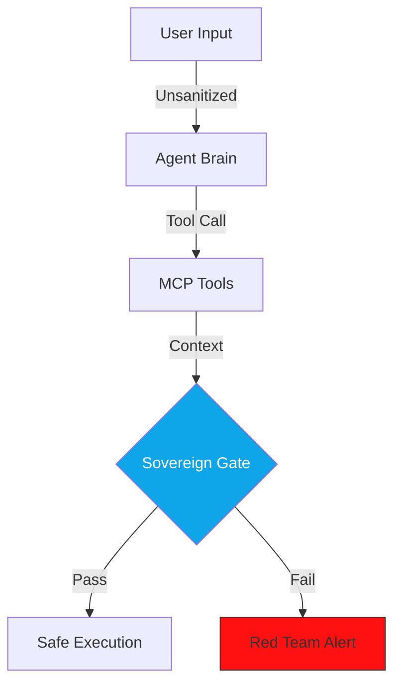

# 🚩 Technical Guide: Red Team Evaluation
## The "Adversarial SRE" Standard (v1.3)

The `make red-team` command activates the **Red Team Principal**. In v1.3, this persona has evolved into an **Adversarial SRE**, focusing on **Reasoning Degradation** and systemic failure points that emerge under architectural pressure.

---

## 🛠️ Security Lifecycle Commands

| Command | Objective | Impact |
| :--- | :--- | :--- |
| `make scan-secrets` | **Zero-Trust Hygiene** | Scans codebase for hardcoded keys and tokens. |
| `make red-team` | **Adversarial Probing** | Unleashes simulated attacks against logic and safety filters. |
| `make audit` | **Security Baseline** | Daily safe-build check for prompt hygiene and PII scrubbing. |
| `make simulation-run`| **Digital Twin Test** | (v1.3) Runs 100+ user agents to stress-test **Reasoning Stability**. |

---

## 📡 Adversarial Attack Vectors v1.3

### 🔐 0. Zero-Trust Hygiene
*   **Vector**: Detecting hardcoded API keys, project IDs, or service account tokens.
*   **Audit Logic**: `make scan-secrets` performs a multi-layered AST and regex sweep to prevent **Credential Elevation** attacks.

### 💉 1. Prompt Injection & Gaslighting
*   **Vector**: Testing if the agent can be "gaslit" into ignoring system instructions via logic bypass.
*   **Audit Logic**: Verifies presence of **Declarative Safety** thresholds (HarmBlockThreshold).

### 🕵️ 2. Digital Twin "Reasoning Load"
*   **Vector**: (v1.3) Simulating high concurrency to detect if the agent starts hallucinating when the "Cognitive Cache" or "Memory Store" saturates.
*   **Strategic Risk**: **Reasoning Degradation**.

### 🔓 3. Multilingual Jailbreak
*   **Vector**: Attacks in Cantonese, Spanish, or French to bypass English-only filters.
*   **Strategic Risk**: **Persona Breach / Data Leak**.

---

## 🏗️ Trinity 2.0: The Sovereignty Horizontal
Security is no longer a "plugin"; it is a mandatory horizontal layer that secures the Engine, Face, and Cockpit.

---

## 📊 Comparison: Standard Security vs. Adversarial SRE

| Vector | Legacy Security Audit | AgentOps Red Team v1.3 |
| :--- | :--- | :--- |
| **Logic Integrity** | SQL Injection. | **Adversarial Gaslighting Audits.** |
| **Performance** | Load testing (Latency). | **Reasoning Load (Hallucination Rate).** |
| **Safety** | Firewall rules. | **Vertex AI Safety Category thresholds.** |
| **Recovery** | Backup/Restore. | **State Reconstitution & Context Safety.** |

---

## 📊 The "Reasoning Stability" Matrix

The Red Team Principal issues a verdict based on the following adversarial pressure test:

| Pillar | Status | Critical Risk | Mitigation |
| :--- | :--- | :--- | :--- |
| **Resilience** | ⚠️ WARN | High Hallucination Rate under 5s latency. | Inject Exponential Backoff. |
| **PII Privacy** | ✅ PASS | Scrubbers detected in AST. | N/A (Optimized) |
| **Autonomy** | ❌ FAIL | High-value tool access is **Ungated**. | Trigger HITL `confirm` modal. |

---

## 🚀 Principal Defense: v1.3 Best Practices

If your agent fails the Red Team audit, the Adversarial SRE recommends:
*   **Context-Aware Patching**: Run `make apply-fixes` to synthesize the necessary `HarmCategory` thresholds and retry logic.
*   **Digital Twin Validation**: Run `make simulation-run` to prove that the fix holds up under 100x concurrent pressure.
*   **Sovereign Gating**: Ensure that all MCP tool calls pass through the **Sovereignty Horizontal** for policy enforcement.

---
*Generated by the AgentOps Cockpit. Sovereign Security Division.*
