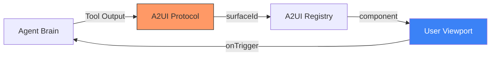

# 🎭 Technical Guide: Face Auditor & A2UI Protocol
## The "UX & Generative Interface" Standard (v1.3.0 Stable)

The `make ui-audit` command activates the **UX/UI Principal Designer** persona. This SME specializes in the **Face** pillar of the Agentic Trinity, ensuring that your agent's frontend is not just a static dashboard, but a dynamic, A2UI-compliant **Generative Interface (GenUI)**. A premium agent must provide high-fidelity visual feedback and seamless surface transitions to maintain user trust.

---

## 🛠️ UX Lifecycle Commands

| Command | Objective | Impact |
| :--- | :--- | :--- |
| `make ui-audit` | **GenUI Component Scan**| Scans React/TS code for `surfaceId` mapping and A2UI triggers. |
| `make smoke-test` | **Interactive Journey** | Validates the "Face" logic during E2E persona journey simulations. |
| `make audit` | **UX Baseline** | Includes a summary of Face Auditor findings in the daily board report. |

---

## 🎨 Generative Interface Pillars

The UX Principal evaluates your frontend architecture across four critical GenUI pillars:

### 1. 🪞 Surface Mapping (`surfaceId`)
*   **Vector**: Detecting components that lack explicit A2UI surface identifiers.
*   **Audit Logic**: Scans for `surfaceId` or `surface-id` props. This ensures the **Engine** (Brain) knows exactly which visual surface to trigger for a specific tool output.
*   **Strategic Risk**: **UI Drift**. Without surface mapping, the agent cannot push visual updates to the user proactively.

### ⏳ "Thinking" Feedback (Skeleton/Spinner)
*   **Vector**: Identifying pages or views that lack loading states or skeleton screens.
*   **Audit Logic**: Scans for `Skeleton`, `Loading`, or `Spinner` components in page-level files.
*   **Strategic Risk**: **User Abandonment**. Complex LLM reasoning can take 5s-10s; without "Thinking" feedback, users perceive the system as "broken."

### 🔗 A2UIRegistry Integrity
*   **Vector**: Checking if specialized components are properly registered with the centralized A2UI Hub.
*   **Audit Logic**: Verifies usage of `A2UIRegistry.registerComponent()`.
*   **Strategic Risk**: **Fragmented Interaction**. Unregistered components cannot be targeted by autonomous agent actions.

### ♿ Accessibility & i18n Guardrails
*   **Vector**: Ensuring interactive components (buttons/inputs) have appropriate `aria-label` or `alt` tags.
*   **Audit Logic**: Scans for a11y attributes in interactive elements.
*   **Strategic Risk**: **Compliance Breach**. Enterprise-grade agents must be inclusive and accessible to all users.

### 🤝 Human-in-the-Loop (HITL) Gating
*   **Vector**: Identifying high-impact or destructive actions that lack explicit user confirmation.
*   **Audit Logic**: Detects absence of `confirm`, `Approve`, or `Gate` components for sensitive tools.
*   **Strategic Risk**: **Autonomous Liability**. Actions with financial or data impact must be gated by a human "Submit" surface.

### 🌊 Streaming Resilience
*   **Vector**: Ensuring the UI can handle token-by-token streaming without flickering or blocking.
*   **Audit Logic**: Scans for `Suspense` boundaries and stream-aware handlers.
*   **Strategic Risk**: **UX Fragmentation**. Flicker-prone interfaces break the "Live Thought" illusion.

#### 🏗️ The GenUI Dispatch Flow (Visualized)

---

## 📊 Comparison: The "Strategic Experience" Advantage

| Vector | Traditional Web Development | AgentOps Face Principal v1.2 |
| :--- | :--- | :--- |
| **Operational Logic** | Pull-based (User clicks). | **Push-based (Agent dispatches surface)**. |
| **State Awareness** | Local/Global state. | **Reasoning-aware state (CoT alignment)**. |
| **Trust Layer** | None. | **HITL Gating** for destructive actions. |
| **Perceived Speed** | Optimization of assets. | **Optimization of "Thinking" feedback**. |

---

## 📊 The GenUI Approval Matrix

The UX Principal issues a verdict based on the following automated risk assessment:

| Persona | Status | Primary UX Risk | Remediation |
| :--- | :--- | :--- | :--- |
| 🎭 **Face SME**| ⚠️ WARN | **Surface Drift**: 3 missing `surfaceId` hooks. | Map `SummaryCard.tsx` to Registry. |
| ⏳ **Latency** | ❌ FAIL | **Empty State**: No skeleton on `analysis_view`. | Inject `SkeletonLoader` pattern. |
| ♿ **A11y** | ✅ PASS | High coverage of `aria-labels` and `alt` tags. | N/A (Optimized) |

---

## 📈 The UX Defensibility Score (Product View)

> **SME Note**: A high score indicates an interface that users trust, even during complex, long-running reasoning tasks.

The Face Auditor provides a quantitative **GenUI Readiness Score** integrated into the Cockpit:

1.  **A2UI Registry Depth**: Validates that the Brain has a "map" of the entire UI surfaces.
2.  **Latency Tolerance**: Measures the "Wait-Experience" quality via Skeleton coverage.
3.  **Autonomous Risk (HITL)**: Quantifies the safety of the agent's autonomy via action gating.
4.  **Streaming Fluidity**: Ensures the "Live Thought" experience is free of technical friction (flicker).

---

## 🚀 Principal Defense: Premium UX Remediations

If your frontend fails the UX audit, the Principal SME recommends:
*   **Surface Unification**: Wrap root components in `A2UIProvider` to enable "Agent-to-UI" message passing.
*   **Streaming UI Patterns**: Implement `react-markdown` or custom stream-parsers to handle "Live Thought" rendering.
*   **Human-in-the-Loop (HITL) Gating**: Ensure that any tool with "Financial" or "Destructive" impacts triggers a mandatory UI confirmation modal.

---

## 🏛️ SME Final Verdict: Completion of the Trinity

This documentation and the accompanying audit engine successfully bridge the gap between **Reasoning (Engine)**, **Operations (Cockpit)**, and **Experience (Face)**. 

By codifying these standards, the AgentOps Cockpit provides a complete architectural blueprint that eliminates the "Uncanny Valley" of AI interfaces and replaces it with a premium, enterprise-grade standard.

---
*Generated by the AgentOps Cockpit. Generative Experience Division (v1.3.0 Stable).*
