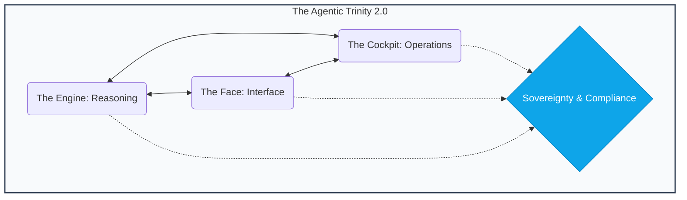

# 🕹️ AgentOps Cockpit

<div align="center">
  
</div>

<div align="center">
  <br />
  <a href="https://agent-cockpit.web.app" target="_blank"><strong>🌐 Official Website & Live Demo</strong></a>
  <br /><br />
  <a href="https://deploy.cloud.google.com?repo=https://github.com/enriquekalven/agent-cockpit">
    
  </a>
  <br />
  <br />
  
  
  
  
</div>

<br />

<div align="center">
  <h3>"Infrastructure gives you the pipes. We give you the Intelligence."</h3>
  <p>The developer distribution for building, optimizing, and securing AI agents on Google Cloud.</p>
</div>

---

## 📽️ The Mission
Most AI agent templates stop at a single Python file and an API key. **The AgentOps Cockpit** is for developers moving into production. It provides framework-agnostic governance, safety, and cost guardrails for the entire agentic ecosystem.

- **Governance-as-Code**: Audit your agent against [Google Well-Architected](/docs/GOOGLE_ARCHITECTURE.md) best practices with the **Evidence Bridge**—real-time citations for architectural integrity.
- **SME Persona Audits**: Parallelized review of your codebase by automated [**Principal SMEs**](docs/TECHNICAL_AUDIT_GUIDE.md) across FinOps, SecOps, Architecture, and Quality.
- **Agentic Trinity**: Dedicated layers for the Engine (Logic), Face (UX), and Cockpit (Ops).
- **A2A Connectivity**: Implements the [**Agent-to-Agent Transmission Standard**](docs/TECHNICAL_A2A_GUIDE.md) for secure swarm orchestration.
- **MCP Native**: Registration as a [Model Context Protocol](https://modelcontextprotocol.io) server for 1P/2P/3P tool consumption.

## 🚀 Quick Start: One Command to Rule Them All

The AgentOps Cockpit is designed for high-velocity fleet management. If you are overwhelmed by the options, just remember **one command**:

```bash
# 🕹️ Mission Control: Master Audit, Persona Review, & Fleet Tracking
agentops-cockpit cockpit
```

This single command launches the **Distinguished Fellow Master Dashboard**, where the principal SMEs (Architecture, Security, FinOps) provide a summary of your workspace and guide you toward deeper persona mandates.

### 🏛️ The Sovereign Workflow
1. **Explore**: `agentops-cockpit cockpit` (Mission Control)
2. **Modernize**: `agentops-cockpit mcp blueprint` (Legacy -> MCP Bridge)
3. **Certify**: `agentops-cockpit certify` (Production Readiness Badge)
4. **Evolve**: `agentops-cockpit deploy sovereign` (The Master Move)

---

## 🏗️ The Agentic Trinity
We divide the complexity of production agents into three focused pillars:



- **⚙️ The Engine**: The reasoning core. Built with **ADK**, FastAPI, and Vertex AI.
- **🎭 The Face**: The user experience. [Adaptive UI surfaces](docs/TECHNICAL_UX_GUIDE.md) and **GenUI** standards via the A2UI spec.
- **🕹️ The Cockpit**: The operational brain. [Cost control](docs/TECHNICAL_FINOPS_GUIDE.md), semantic caching, shadow routing, and [adversarial audits](docs/TECHNICAL_REDTEAM_GUIDE.md).

<div align="center">
 
</div>

---

## 🏛️ v2.0.2: The "Sovereign Master Build" (LATEST)
Evolving into the Industry Standard Logic Layer for production AI agents. See the [**v2.0.2 Release Notes**](/CHANGELOG.md).
v2.0.2 introduces **Engineering Resilience** and **Structural Sovereignty**, shifting focus from tactical implementation to cross-provider architectural immunity.

- **🛡️ SafetyGate SDK**: The official Sovereign Safety SDK for PII scrubbing, HITL (Human-in-the-Loop) gating, and AST-aware Taint Tracking.
- **🏗️ Structural Monolith Detection**: Automatically identifies oversized agent files (>200 lines) and scaffolds modular splits to maintain reasoning density.
- **🧗 Resilience Cordon**: Added `--cordon` mode to bypass registry auth failures (401/403) and isolate audit environments.
- **📦 Venv Isolation**: Automatic sidecar virtual environment provisioning for zero-dependency audit execution.
- **💰 Opex Simulation**: Predictive token costing heuristics to forecast the monthly budget impact of reliability and security fixes.
- **🏛️ Strategic Paradigm Auditor (`audit arch`)**: Detect high-level architectural mismatches. Are you using RAG for math? Prompt-stuffed structured data analysis?
- **🛰️ Fleet Hub (`fleet`)**: Stateful registry and runtime oversight. Monitor health with `fleet status` and watch ecosystem sync with `fleet watch`.
- **🛡️ Audit Hub (`audit`)**: Principal SME board. Run master reviews with `audit report` and project token deltas with **Opex Sim**.
- **🚀 Deployment Hub (`deploy`)**: The multi-cloud factory. End-to-End pipelines via `deploy sovereign` for GCP/AWS/Azure.
- **🔧 Evolution Hub (`fix`)**: Autonomous code synthesis. Apply targeted audit fixes with `fix issue` or trigger the `fix evolve` "PR Closer".
- **🧠 Knowledge Hub (`rag`)**: RAG Truth-Sayer. Audits RAG pipelines for grounding and indexing loyalty.
- **📡 Interop Hub (`mcp`)**: Tool Governance. Discover and integrate Model Context Protocol (MCP) tools via `mcp list/install`.

---

## 🚀 Key Innovation: The "Intelligence" Layer

### 🛡️ SafetyGate & Taint Tracking
Don't wait for your users to find prompt injections or PII leaks. Use the built-in [**SafetyGate SDK**](docs/TECHNICAL_AUDIT_GUIDE.md) and **AST Taint Tracking** to detect and block unsanitized user query flows before they hit sensitive tool sinks.

### 💰 Opex Simulation (Economist Persona)
**Project your TCO before you scale.** The Economist persona now simulates the token impact of your hardening measures (e.g., "Adding exponential backoff will increase token usage by 15% but save 100% of failed tasks").

### 🏗️ Arch Review & Structural Monoliths
Every agent in the cockpit is graded against a framework-aware checklist. The Cockpit now detects "Structural Monoliths"—files that have grown too large for reliable reasoning—and provides the **Managed Router** scaffold to split them.

### 🕹️ Venv Isolation & Cordoning
Stop fighting with local Python environments. The Cockpit provisions a managed **Audit Venv** sidecar and uses **Cordon Mode** to bypass corporate registry friction, ensuring your CI/CD gates are always green.

### 🗄️ Multi-Cloud Sovereign Governance
Unified security and architectural auditing for **Vertex AI (GCP)**, **Bedrock (AWS)**, and **OpenAI (Azure)**. Provision Bedrock Guardrails or Azure Entra IDs directly from audit recommendations.

---

### 🛡️ Advanced Governance & Industry Hardening (v2.0.2)
Modern agents don't just live in `agent.py`. The Cockpit uses the **Universal Remediator v2.0.2** to intelligently map and heal your project:
- **Safety SDK Library**: Automatically injects `SafetyGate` shims for enterprise-grade redaction.
- **HITL Verification**: Scaffolds A2UI-compatible approval surfaces (`HitlSurface.tsx`) for high-stakes tool calls.
- **Delta Reporting**: "Diff-Only" report modes to reduce context noise in large fleet audits.
- **Artifact Store**: All data (SARIF, Evidence, HTML) is now sovereignly stored in the `.cockpit/` directory.

---

## ⌨️ Master Command Registry

The Cockpit is available as a first-class CLI and a comprehensive Makefile-based operational toolkit.

| Registry | Description |
| :--- | :--- |
| 🕹️ [**Makefile Commands**](docs/TECHNICAL_COMMANDS_MASTER.md) | Standard local development and orchestration shortcuts. |
| 🚀 [**UVX Master Guide**](docs/TECHNICAL_UVX_MASTER.md) | Portable, zero-install commands for CI/CD and automation. |

---

## 🧑‍💼 Principal SME Persona Approvals
The Cockpit now features a **Multi-Persona Governance Board**. Every audit result is framed through the lens of a Principal Engineer in that domain:
*   [**🏛️ Architecture**](docs/TECHNICAL_ARCH_REVIEW.md)
*   [**💰 FinOps**](docs/TECHNICAL_FINOPS_GUIDE.md)
*   [**🛡️ Red Team**](docs/TECHNICAL_REDTEAM_GUIDE.md)
*   [**🧗 Quality**](docs/TECHNICAL_QUALITY_GUIDE.md)
*   [**🌐 Infrastructure**](docs/TECHNICAL_INFRA_GUIDE.md)
*   [**🎭 UX/UI**](docs/TECHNICAL_UX_GUIDE.md)

<div align="center">
  
  
  
</div>
<div align="center">
  
  
  
</div>

---

## 🚀 Production Readiness Auditor
The Cockpit serves as the final gate before production deployment. `make deploy-prod` triggers a deep benchmark of the entire ecosystem:
1. **v2.0.2 Deep System Audit**: Benchmarks models (Gemini 2.0 Pro/Flash, GPT-4o, Claude 3.5) and logic.
2. **Stress Testing**: Load testing endpoints to ensure concurrency safety.
3. **Red Team Verification**: Adversarial security scans for prompt injection and PII.
4. **Resiliency Check**: Verifies `@retry` logic and `timeout` guards are active.

---

---

## 🛡️ Privacy & Telemetry
The AgentOps Cockpit follows a **Privacy-First, Sovereign Standard**. 

By default, the CLI sends anonymous operational metrics (e.g., event names, OS type, success rates) to the **Global Pulse** hub to help us understand fleet health and prioritize improvements. **We do not collect names, emails, code snippets, secrets, or folder paths.**

### 🌑 How to Opt-Out
If you prefer 100% isolation, you can disable telemetry by setting the following environment variable in your shell:
```bash
export AGENTOPS_TELEMETRY_ENABLED=false
```
Alternatively, you can set it in your local `cockpit.yaml`:
```yaml
telemetry:
  enabled: false
```

---

## 🤝 Ecosystem & Attribution
The AgentOps Cockpit is designed to leverage and secure the best-of-breed tools in the Google Cloud ecosystem. We explicitly acknowledge and leverage the excellent work from:

*   **[GoogleCloudPlatform/agent-starter-pack](https://github.com/GoogleCloudPlatform/agent-starter-pack/)**: We leverage this as a core reference for the **Agent Development Kit (ADK)** patterns and Vertex AI Agent Engine integration.
*   **[A2UI Protocol](https://github.com/GoogleCloudPlatform/agent-starter-pack/tree/main/src/a2ui)**: Standardized Generative UI handshake for building adaptive, agentic user interfaces.
*   **[A2A Standard](https://github.com/GoogleCloudPlatform/agent-starter-pack/blob/main/docs/A2A_GUIDE.md)**: Agent-to-Agent Transmission Protocol for secure swarm intelligence and inter-agent communication.
*   **[Model Context Protocol (MCP)](https://modelcontextprotocol.io)**: Our unified tool execution standard, enabling portable and secure 1P/2P/3P integrations.
*   **[LangChain & LangGraph](https://python.langchain.com/)**: Foundational libraries for stateful, multi-agent reasoning loops and graph-based orchestration.
*   **[CrewAI](https://www.crewai.com/)**: Multi-agent framework used as a reference for collaborative task execution and role-playing agents.
*   **[Firebase](https://firebase.google.com/)**: Provider for enterprise-grade hosting and global distribution of the **Face** layer.
*   **[Google Cloud Run & GKE](https://cloud.google.com/run)**: High-scale orchestration platforms for the **Engine** and cluster-wide agent fleets.
*   **[Vertex AI SDK](https://cloud.google.com/vertex-ai/docs/python-sdk)**: The backbone for frontier reasoning (Gemini 3) and enterprise-grade model governance.
*   **[Tenacity](https://tenacity.readthedocs.io/)**: The gold-standard library for the exponential backoff and resiliency patterns we enforce.
*   **[Rich](https://rich.readthedocs.io/)**: Modern visualization engine that powers the high-fidelity Cockpit CLI experience.

---
*Reference: [Google Cloud Architecture Center - Agentic AI Overview](https://docs.cloud.google.com/architecture/agentic-ai-overview)*
