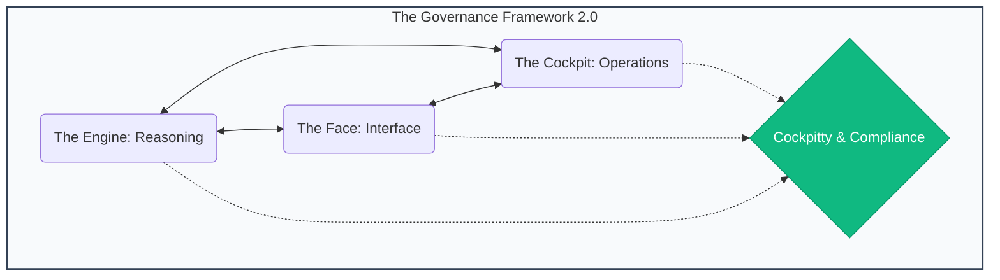

# 🕹️ AgentOps Cockpit (v2.0.15 Autonomous Core)

<div align="center">
  
</div>

<div align="center">
  <br />
  <a href="https://agent-cockpit.web.app" target="_blank"><strong>🌐 Official Website & Live Demo</strong></a>
  <br /><br />
  <a href="https://deploy.cloud.google.com?repo=https://github.com/enriquekalven/agent-cockpit">
    
  </a>
  <br />
  <br />
  
  
  
  

</div>

<br />

<div align="center">
  <h3>"Infrastructure gives you the pipes. We give you the Intelligence."</h3>
  <p>The developer distribution for building, governing, and scaling Cockpit AI agents.</p>
</div>

---

## 🚀 The Cockpit Mission
Most AI templates stop at a single Python script. **The AgentOps Cockpit** is for developers moving into production. It provides framework-agnostic governance, multi-cloud mobility, and real-time security for the entire agentic ecosystem.

- **🏛️ The Governing Board**: Every repository is audited by a panel of [**Principal SME Personas**](docs/TECHNICAL_AUDIT_GUIDE.md) (SecOps, FinOps, SRE, Architect) using **SME Reasoning**.
- **📊 Premium Visual Dashboards**: v2.0.15 introduces AST-aware precision scanning and Vertex AI-style fleet dashboards.

- **🌉 Cockpit Bridge**: Multi-cloud orchestration layer for GCP, AWS, and Azure.
- **The Cockpit**: Python CLI, **Cockpit Gateway**, Semantic Caching, Red Team Eval.
- **Integrations**: [LangChain](/docs/LANGCHAIN_INTEGRATION.md), CrewAI, LangGraph.
- **Deployment**: Firebase Hosting (Face), Google Cloud Run / GKE (Engine/Cockpit).

---

## ⚡ Quick Start: One Command to Rule Them All

The Cockpit is designed for high-velocity fleet management. If you are overwhelmed by the options, just remember **one command**:

```bash
# 🕹️ Master Audit: Launch the Governing Board & Personal SME Review
ops report
```

### 🏹 The Cockpit Workflow
1. **Explore**: `cockpit` (Launch the Mission Control Dashboard)
2. **Audit**: `ops report` (Deep SME Reasoning Review)
3. **Remediate**: `make apply-fixes` (Autonomous code hardening via the **Closer Engine**)
4. **Evolve (Viral)**: `ops evolve` (Autonomously refactor and upgrade your framework logic)
5. **Deploy**: `ops deploy cockpit` (Multi-cloud Factory Deployment)

## 🗺️ Project Roadmap
- [x] **v2.0.15**: Autonomous Core (GC-Style Reporting, Fleet Dashboard v2, Anomaly Metadata).
- [x] **v2.0.15**: Autonomous Core & Sanitized Signal (AST Scanners, MarkUp Sanitization, SLA Gates).
- [ ] **v2.1.0**: Collaborative Governance (Multi-Persona Benchmarking, MCP Hub v2).


---

## 🏗️ The Governance Framework
We divide the complexity of production agents into three focused pillars:


```mermaid
graph TD
   subgraph Trinity [The Governance Framework 2.0]
       E(The Engine: Reasoning)
       F(The Face: Interface)
       C(The Cockpit: Operations)
       S{Cockpitty & Compliance}
   end
   E <--> C
   F <--> C
   E <--> F
   E -.-> S
   F -.-> S
   C -.-> S
   style Trinity fill:#f8fafc,stroke:#334155,stroke-width:2px
   style S fill:#10b981,color:#fff,stroke:#059669
```

- **⚙️ The Engine**: The reasoning core. Built with **ADK**, FastAPI, and Vertex AI.
- **🎭 The Face**: The user experience. [Cockpit UX (A2UI)](docs/TECHNICAL_UX_GUIDE.md) and rich GenUI standards.
- **🕹️ The Cockpit**: The operational brain. [Cost control (FinOps)](docs/TECHNICAL_FINOPS_GUIDE.md), semantic caching, and [adversarial audits (Red Team)](docs/TECHNICAL_REDTEAM_GUIDE.md).

---

## 🏛️ v2.0.15: The "Autonomous Core" Release
Evolving into the industry standard for production governance. See the [**CHANGELOG.md**](/CHANGELOG.md).

- **🛡️ AST-Aware Scanning**: Structural code analysis for retries and prompt invariants.
- **📊 Sanitized Reporting**: Secure console output via `rich.markup.escape()` and Cluster Deduplication.

- **📊 Autonomous Core Dashboard**: Google Cloud-grade visual reporting for executive stakeholders.
- **🌉 Cockpit Bridge**: Multi-cloud deployment to GCP, AWS, and Azure.
- **🧠 Semantic distributed cache**: Distributed caching that reduces LLM costs by up to 40%.
- **🔧 Closer Engine 2.0**: Autonomous remediation of code gaps and architectural debt.

---

## 🏛️ Multi-Persona Governance Board
The Cockpit allows you to view your codebase through the lens of a Principal Engineer:
*   [**🏛️ Architecture**](docs/TECHNICAL_ARCH_REVIEW.md)
*   [**⚖️ Compliance**](docs/TECHNICAL_COMPLIANCE_GUIDE.md)
*   [**💰 FinOps**](docs/TECHNICAL_FINOPS_GUIDE.md)
*   [**🛡️ Red Team**](docs/TECHNICAL_REDTEAM_GUIDE.md)
*   [**🧗 Quality**](docs/TECHNICAL_QUALITY_GUIDE.md)
*   [**🌐 SRE & Infra**](docs/TECHNICAL_INFRA_GUIDE.md)
*   [**🎭 UX (A2UI)**](docs/TECHNICAL_UX_GUIDE.md)

---

## 🤝 Ecosystem & Attribution
The AgentOps Cockpit leverages and secures the best-of-breed tools in the ecosystem:

*   **[Google ADK](https://github.com/GoogleCloudPlatform/agent-starter-pack/)**: Core reference for agent patterns.
*   **[A2UI Protocol](https://github.com/GoogleCloudPlatform/agent-starter-pack/tree/main/src/a2ui)**: Standardized Generative UI handshake.
*   **[Model Context Protocol (MCP)](https://modelcontextprotocol.io)**: Unified tool execution standard.
*   **[Vertex AI SDK](https://cloud.google.com/vertex-ai/docs/python-sdk)**: Backbone for frontier reasoning.
*   **[Firebase](https://firebase.google.com/)**: Enterprise hosting for the **Face** layer.

---
*Generated by the AgentOps Cockpit. Cockpit Systems Division (v2.0.15 Autonomous Core).*

