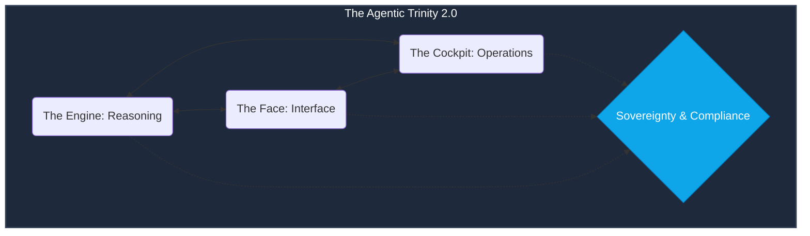

## The "Ecosystem Expansion" Release (v1.4.7 Stable)

The `make audit` command is the heartbeat of the **AgentOps Cockpit**. From v1.4.7 onwards, we have introduced **RAG Fidelity Auditing**, **Maturity Expertise Matrix**, and the **Interactive Remediation Workbench**.

👉 **[Core Capabilities & Regression Registry](CAPABILITIES_REGISTRY.md)**

---

## 🏗️ The Agentic Trinity 2.0
Every audit is framed against the new Trinity architecture, where **Sovereignty & Compliance** act as a mandatory horizontal layer securing the Engine, Face, and Cockpit.

---

## 🛠️ Audit Lifecycle Commands

| `make audit` | **Evaluation** | Dev-velocity: Secrets, Reliability, and Fast Security. | Orchestrates `secret_scanner.py` and `reliability.py` (Mode: Quick). |
| `make audit-deep` | **Deep Probe** | The "Final Examination": RAG Fidelity, stress tests, and benchmarks. | Triggers full suite including `rag_audit.py` and `red_team.py`. |
| `make arch-review`| **Evolution** | v1.3: **Context-Aware Patching** via LLM Synthesis. | Leverages `arch_review.py` and `remediator.py` for AST-based evolution. |
| `make simulation-run`| **Digital Twin**| v1.3: 100+ Adversarial User Agents stress-test reasoning.| Parallelized execution of `swarm.py` utilizing the `ShadowRouter`. |
| `ops report` | **Optimization** | v1.4: Master Orchestrator with **Maturity Intelligence**. | Generates the premium HTML dashboard with maturity radar visualization. |
| `ops audit-maturity`| **Maturity Matrix**| v1.4.7: High-fidelity expertise and persona status dashboard. | Displays the Cockpit's expertise levels across frameworks/platforms. |
| `ops workbench` | **Remediation** | v1.4: TUI-based Patch Negotiation. | Interactive loop for reviewing and approving autonomous fixes. |

---

## 🎯 Modular Auditing & Filtering (v1.4.0)
Modern audits shouldn't be "all or nothing." v1.4.0 introduces high-precision filtering:
- **`--only [category]`**: Run only specific personas (e.g., `ops report --only rag-truth`).
- **`--skip [category]`**: Exclude heavy audits (e.g., `ops report --skip red-team`) for faster CI feedback.

---

## 📁 Artifact Sovereignty: The `.cockpit/` Store
To respect project hygiene and maintain compliance history, all audit outputs are now centralized:
- **`.cockpit/evidence_lake/`**: Partitioned audit snapshots (JSON).
- **`.cockpit/cockpit_report.html`**: The unified stakeholder dashboard.
- **`.cockpit/cockpit_audit.sarif`**: Security analysis results for IDE/GitHub integration.

---

## 📜 The Evidence Bridge Protocol
The **Evidence Bridge** (`src/agent_ops_cockpit/ops/evidence_bridge.py`) serves as the "Common Language" between the specialized SMEs. It captures:
1.  **SDK Citations**: Direct links to Google Cloud / ADK documentation for best practice verification.
2.  **Maturity Velocity**: A trend metric tracking if an agent is becoming more compliant or regressing over time.
3.  **Poka-Yoke Metadata**: Hardened schema definitions extracted from the AST during the audit.

👉 **[View Master Command Registry (All Personas)](docs/TECHNICAL_COMMANDS_MASTER.md)**

---

## 🏢 The SME Persona Matrix (v1.3)

### 1. 🔐 SecOps Principal (Sovereign Security)
*   **Mission**: Zero-trust credential hygiene and Multi-Cloud Sovereignty.
*   **Checks**: Scans for secrets and checks the **Sovereignty Score** for vendor lock-in risk.

### 2. 🏛️ Autonomous Architect (Evolution)
*   **Mission**: Systemic integrity and autonomous code synthesis.
*   **v1.3 Shift**: Moves from template fixes to **Context-Aware Patching**, generating PRs that match your project's style.

### 3. 🧗 AI Quality SME (Deep Probe)
*   **Mission**: Iterative prompt optimization (Hill Climbing). 
*   **Mission (Deep Mode)**: Executes 50+ iterations to find the "Optimal System Prompt" that maximizes reasoning accuracy.

### 4. ⚖️ Governance SME (Trinity Compliance)
*   **Mission**: Mandatory horizontal compliance (NIST/SOC2/HIPAA).
*   **Checks**: Validates system prompts against the **Sovereign Gate** policies.

### 6. 🌊 Context Engineering SME (v1.3)
*   **Mission**: Improving reasoning density and trajectory stability.
*   **Checks**: Validates **Tool Schema Hardening (Poka-Yoke)** and **Context Compaction** to maintain high-fidelity state without token waste.

### 6. 🚩 Red Team Principal (Adversarial SRE)
*   **Mission**: "Reasoning Degradation" detection under pressure.
*   **Mission (Deep Mode)**: Unleashes the full adversarial injection suite, including **Latency Injection** and multilingual jailbreak attempts.

---

## 📊 Comparison: Standard DevOps vs. Autonomous Architect

| Feature | Standard DevOps | AgentOps v1.3 "Autonomous" |
| :--- | :--- | :--- |
| **Fixing Flaws** | Manual Jira tickets. | **LLM-Synthesized PRs (Auto-remediation).** |
| **Scale Test** | Virtual Users (Network). | **Digital Twin Agents (Reasoning Load).** |
| **Cost Control** | Cloud Billing Alerts. | **Predictive Token Density Waterfall.** |
| **Security** | Static Analysis (SAST). | **Adversarial Gaslighting Audits.** |

---

## 📊 The Evidence Bridge (SME Directory)

The audit doesn't just give a "Pass/Fail." It provides **Actionable Intelligence** via specialized technical manuals for each pillar of the Trinity:

*   **Architecture Review**: [`docs/TECHNICAL_ARCH_REVIEW.md`](docs/TECHNICAL_ARCH_REVIEW.md)
*   **AI Quality (Hill Climbing)**: [`docs/TECHNICAL_QUALITY_GUIDE.md`](docs/TECHNICAL_QUALITY_GUIDE.md)
*   **Red Team (Security)**: [`docs/TECHNICAL_REDTEAM_GUIDE.md`](docs/TECHNICAL_REDTEAM_GUIDE.md)
*   **FinOps (Economics)**: [`docs/TECHNICAL_FINOPS_GUIDE.md`](docs/TECHNICAL_FINOPS_GUIDE.md)
*   **Face Auditor (UX/UI)**: [`docs/TECHNICAL_UX_GUIDE.md`](docs/TECHNICAL_UX_GUIDE.md)
*   **AI Infra & SRE**: [`docs/TECHNICAL_INFRA_GUIDE.md`](docs/TECHNICAL_INFRA_GUIDE.md)
*   **A2A Interoperability**: [`docs/TECHNICAL_A2A_GUIDE.md`](docs/TECHNICAL_A2A_GUIDE.md)

---

## 🚀 Usage Scenarios v1.0.0

### **The "Autonomous Fix" (PR Factory)**
Run `make apply-fixes`. In v1.0, the Cockpit analyzes the AST and synthesizes a patch that follows your specific variable naming and testing patterns, prepping a PR automatically.

### **The "Digital Twin" Simulation**
Run `make simulation-run` before a major launch. Simulating 100 agents helps you identify if the **Engine** starts losing its "Contextual Thread" when database latency spikes in the **Cockpit**.

### **The "Production Readiness Auditor" (Deep Mode)**
Run `make deploy-prod` before a production deployment. This triggers the **Full Stress Test** and **Deep Red Team** to ensure the system survives enterprise-scale reasoning load and complies with all Sovereign standards.

---
---
---
*Generated by the AgentOps Cockpit Orchestrator. Engineering Governance Division (v1.4.7 Stable).*
