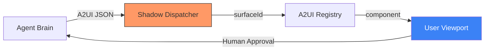

# 🎭 Technical Guide: Face Auditor & A2UI Protocol
## The "Standardized Ecosystem" Standard (v1.8.4 Stable)

The `make ui-audit` command activates the **UX/UI Principal Designer** persona. This SME specializes in the **Face** pillar of the Agentic Trinity, ensuring that your agent's frontend is not just a static dashboard, but a dynamic, A2UI-compliant **Generative Interface (GenUI)**. A premium agent must provide high-fidelity visual feedback and seamless surface transitions to maintain user trust.

---

## 🛠️ UX Lifecycle Commands

| Command | Objective | Impact | Technical Driver |
| :--- | :--- | :--- | :--- |
| `make ui-audit` | **GenUI Component Scan**| Scans React/TS code for `surfaceId` mapping and A2UI triggers. | `ui_auditor.py` (React AST parser) |
| `make smoke-test` | **Interactive Journey** | Validates the "Face" logic during E2E persona journey simulations. | `cypress` / `playwright` (Mocked) |
| `make audit` | **UX Baseline** | Includes a summary of Face Auditor findings in the daily report. | `audit.py` Integration |
| `make maturity`| **Expertise Matrix**| Displays the Cockpit's UX competency and persona status (v1.8.4). | `ops audit-maturity` |

---

## 🎨 Generative Interface Pillars

The UX Principal evaluates your frontend architecture across four critical GenUI pillars:

### 1. 🤝 The A2UI Handshake (Surface Mapping)
*   **The "Brain-to-UI" Protocol**: The `A2UIProtocol` defines how the **Engine** requests a specific **Face** surface.
*   **Implementation**: Using `A2UIRegistry.registerComponent('summary-card', SummaryCard)`, the developer creates a "Surface Address" that the Brain can target via JSON responses:
    ```json
    {
      "action": "RENDER_SURFACE",
      "surfaceId": "summary-card",
      "data": { ... }
    }
    ```
*   **Audit Logic**: The Face Auditor scans for components lacking a `data-surface-id` or explicit registry entry.

### ⏳ 2. Cognitive Latency Cues (Visualized Thinking)
*   **Vector**: Identifying "Dark Intervals" where the agent is reasoning but the user has no feedback.
*   **Implementation**: The Auditor recommends the **Skeleton Waterfall** pattern. Instead of a single spinner, it encourages partial data reveals as the agent completes sub-tasks.
*   **Metric**: **Time to Visual Confirmation (TTVC)**—The goal is <500ms for a "Thinking" state reveal, even if the result takes 10s.

### 🛡️ 3. HITL Gating & Action Sovereignty
*   **Vector**: Detecting "Dangerous" tools (e.g., `delete_database`, `send_payment`) that execute without a UI confirmation.
*   **Implementation**: High-impact tools must be mapped to a **Gated Surface**. The A2UI Protocol mandates a `status: "PENDING_APPROVAL"` phase for these tools, requiring a manual human `onclick`.

#### 🏗️ The GenUI Dispatch Flow (Visualized)



---

## 📊 Comparison: The "Strategic Experience" Advantage

| Vector | Traditional Web Development | AgentOps Face Principal v1.2 |
| :--- | :--- | :--- |
| **Operational Logic** | Pull-based (User clicks). | **Push-based (Agent dispatches surface)**. |
| **State Awareness** | Local/Global state. | **Reasoning-aware state (CoT alignment)**. |
| **Trust Layer** | None. | **HITL Gating** for destructive actions. |
| **Perceived Speed** | Optimization of assets. | **Optimization of "Thinking" feedback**. |

---

## 📊 The GenUI Approval Matrix

The UX Principal issues a verdict based on the following automated risk assessment:

| Persona | Status | Primary UX Risk | Remediation |
| :--- | :--- | :--- | :--- |
| 🎭 **Face SME**| ⚠️ WARN | **Surface Drift**: 3 missing `surfaceId` hooks. | Map `SummaryCard.tsx` to Registry. |
| ⏳ **Latency** | ❌ FAIL | **Empty State**: No skeleton on `analysis_view`. | Inject `SkeletonLoader` pattern. |
| ♿ **A11y** | ✅ PASS | High coverage of `aria-labels` and `alt` tags. | N/A (Optimized) |

---

## 📈 The UX Defensibility Score (Product View)

> **SME Note**: A high score indicates an interface that users trust, even during complex, long-running reasoning tasks.

The Face Auditor provides a quantitative **GenUI Readiness Score** integrated into the Cockpit:

1.  **A2UI Registry Depth**: Validates that the Brain has a "map" of the entire UI surfaces.
2.  **Latency Tolerance**: Measures the "Wait-Experience" quality via Skeleton coverage.
3.  **Autonomous Risk (HITL)**: Quantifies the safety of the agent's autonomy via action gating.
4.  **Streaming Fluidity**: Ensures the "Live Thought" experience is free of technical friction (flicker).

---

## 🚀 Principal Defense: Premium UX Remediations

If your frontend fails the UX audit, the Principal SME recommends:
*   **Surface Unification**: Wrap root components in `A2UIProvider` to enable "Agent-to-UI" message passing.
*   **Streaming UI Patterns**: Implement `react-markdown` or custom stream-parsers to handle "Live Thought" rendering.
*   **Human-in-the-Loop (HITL) Gating**: Ensure that any tool with "Financial" or "Destructive" impacts triggers a mandatory UI confirmation modal.

---

## 🏛️ SME Final Verdict: Completion of the Trinity

This documentation and the accompanying audit engine successfully bridge the gap between **Reasoning (Engine)**, **Operations (Cockpit)**, and **Experience (Face)**. 

By codifying these standards, the AgentOps Cockpit provides a complete architectural blueprint that eliminates the "Uncanny Valley" of AI interfaces and replaces it with a premium, enterprise-grade standard.

---
*Generated by the AgentOps Cockpit. Generative Experience Division (v1.3.1 Stable).*
